### Python语言基础

#### Python语言特性

Python是静态还是动态类型？是强类型还是弱类型？动态强类型语言（不少人误以为是弱类型)；动态还是静态指的是编译期还是运行期确定类型；强类型指的是不会发生隐式类型转化

#### Python作为后端语言优缺点

为什么要用Python？胶水语言，轮子多，应用广泛；语言灵活，生产力高；性能问题、代码维护问题、python2/3兼容问题

#### 什么是鸭子类型

**“当看到一直鸟走起来像鸭子、游泳起来像鸭子、叫起来也像叶子，那么这只鸟就可以被称为鸭子。”**

- 关注点再对象的行为，而不是类型(duck typing)
- 比如file, StringIO，socket对象都支持read/write方法（file like object）
- 再比如定义了`__iter__`魔术方法的对象可以用for迭代

#### 什么是monkey patch

**什么是monkey patch？哪些地方用到了？自己如何实现？**

- 所谓的monkey patch就是运行时替换
- 比如gevent库需要修改内置的socket
- from gevent import monkey;monkey.patch_socket()

#### 什么是自省？

- 运行时判断一个对象的类型的能力
- Python一切皆对象，用type, id, isinstance 获取对象类型信息
- inspect模块提供了更多获取对象信息的函数

#### 什么是列表和字典推到

**List Comprehension**

- 比如`[i for i in range(10) if i % 2 == 0]`
- 一种快速生成list/dict/set的方式，用来替代map/filter等
- `(i for i in range(10 if i % 2 == 0))`返回生成器

#### Python之禅

**The Zen of Python**

- Tim Peters编写的关于Python编程的准则
- import this
- 编程拿不准的时候可以参考

### Python2/3差异

#### Python3改进

- print称为函数
- 编码问题。Python3不再有Unicode对象，默认str就是unicode
- 除法变化。Python3除号返回浮点数
- 类型注解(type int)。帮助IDE实现类型检查
- 优化的super()方便直接调用父类函数。
- 高级解包操作。a,b,*rest = range(10)
- Keyword only arguments。限定关键字参数
- Chained exceptions。Python3重新抛出异常不会丢失栈信息
- 一切返回迭代器range，zip，map，dict.values，etc. are all iterators
- yield from 链接子生成器
- asyncio内置库，async/await原生协程支持异步编程
- 新的内置库enum，mock，asyncio，ipaddress，concurrent.futures等
- 生成的pyc文件统一发放到`__pycache__`
- 一些内置库的修改。urllib，selector等
- 性能优化等。。。

#### Python2/3工具

熟悉一些兼容2/3的工具

- six模块
- 2to3等工具转换代码
- `__future__`

### Python函数

#### 可变类型参数与不可变类型参数

- 可变类型作为参数

  ```python
  def flist(l):
      l.append(0)
      print(l)
  l = []
  flist(l)  # [0]
  flist(l)  # [0, 0]
  ```

- 不可变类型作为参数

  ```python
  def fstr(s):
      s += 'a'
      print(s)
  s = ”hehe”
  fstr(s)  # hehea
  fstr(s)  # hehea
  ```

#### Python如何传递参数

**一个容易混淆的问题**

- 传递值还是引用呢？都不是。唯一支持的参数是共享传参
- Call by Object (Call by Object Reference or Call by Sharing)
- Call by sharing(共享传参)。函数形参获得实参中各个引用的副本

#### Python可变/不可变对象

**搞懂可变和不可变内置对象有利于理解函数参数的副作用**

- 哪些是可变对象？哪些不可变？
- 不可变对象 bool/int/float/tuple/str/frozenset
- 可变对象 list/set/dict

 **检测下你是否理解了刚才说的例子？**	

```python
def clear_list(l):
    l = []
ll = [1,2,3]
clear_list(ll)
print(ll)  # [1, 2, 3]
```

#### Python可变参数作为默认参数

记住默认参数只计算一次

```python
def flist(l=[1]):
    l.append(1)
    print(l)
flist()
flist()
```

#### Python *args, **kwargs

**函数传递中*args, **kwargs含义是什么**

- 用来处理可变参数
- *args被打包成tuple
- **kwargs被打包成dict

### Python异常机制

#### 什么是Python的异常

**Python使用异常处理错误（有些语言使用错误码）**

- BaseException
- SystemExit/KeyboardInterrupt/GeneratorExit
- Exception

#### 使用异常的常用场景

**什么时候需要捕获处理异常呢？看Python内置异常的类型**

- 网络请求（超时、连接错误等）
- 资源访问（权限问题、资源不存在）
- 代码逻辑（越界访问、KeyError等）

#### 如何处理异常

搞懂几个关键字

```
try:
    # func                              # 可能会抛出异常的代码
except (Exception1, Exception2) as e:   # 可以捕获多个异常并处理
    # 异常处理的代码
else:
    # pass                              # 异常没有发生的时候代码逻辑
finally:
    pass                                # 无论异常有没有发生都会执行的代码，一般处理资源的关闭和释放
```

#### 如何自定义异常

**如何自定义自己的异常？为什么需要定义自己的异常？**

- 继承Exception实现自定义异常（想想为什么不是BaseException）
- 给异常加上一些附加信息
- 处理一些业务相关的特定异常（raise MyException）

### Python性能分析和优化，GIL

#### 什么是Cpython GIL

GIL, Global Interpreter Lock

- Cpython解释器的内存管理并不是线程安全的
- 保护多线程情况下对Python对象的访问
- Cpython使用简单的锁机制避免多个线程同时执行字节码

#### GIL的影响

**限制了程序的多核执行**

- 同一个时间只能有一个线程执行字节码
- CPU密集程序难以利用多核优势
- IO期间会释放GIL，对IO密集程序影响不大

**对IO密集程序影响不大**

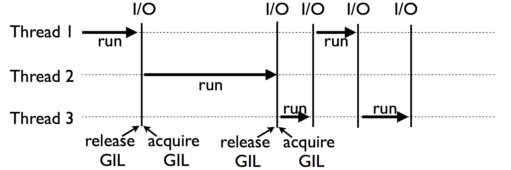

#### 如何规避GIL影响

 **区分CPU和IO密集程序**

- CPU密集可以使用多进程+进程池
- IO密集使用多线程/协程
- cython扩展

#### GIL的实现

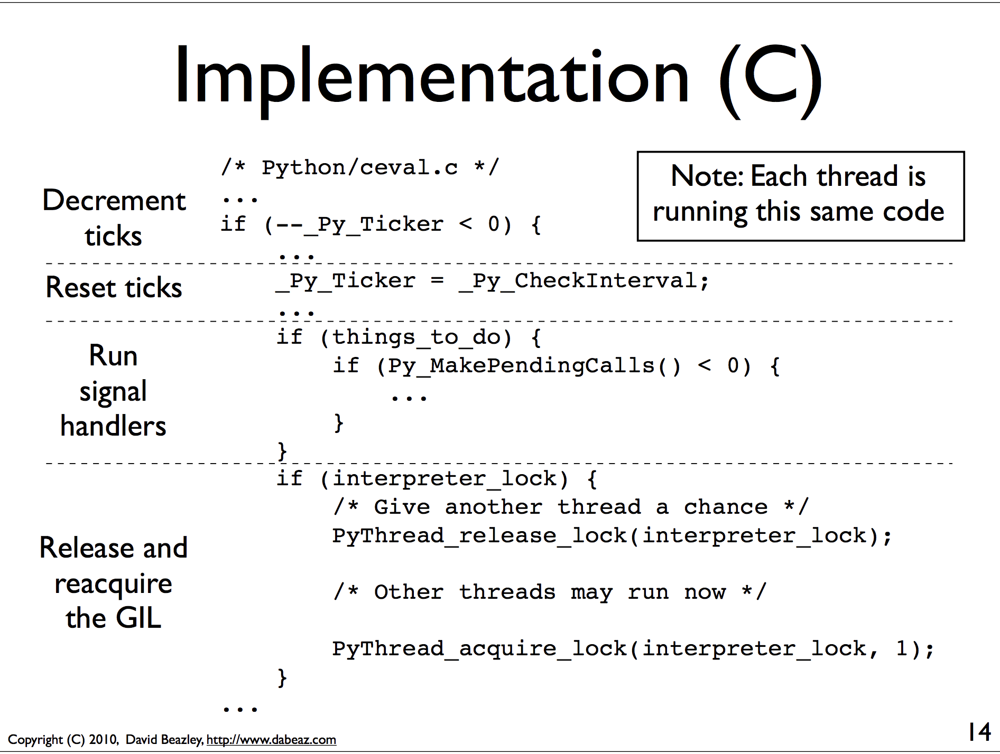

代码输出

```python
import threading

n = [0]

def foo():
    n[0] = n[0] + 1
    n[0] = n[0] + 1

threads = []
for i in range(5000):
    t = threading.Thread(target=foo)
    threads.append(t)

for t in threads:
    t.start()

print(n)  # [10000]
```

#### 为什么有了GIL还要关注线程安全

**Python中什么操作才是原子的？一步到位执行完**

- 一个操作如果是一个字节码指令可以完成就是原子的
- 原子的是可以保证线程安全的
- 使用dis操作来分析字节码

 **原子操作**

```python
import dis

def update_list(l):
    l[0] = 1  # 原子操作，不用担心线程安全问题

dis.dis(update_list)
"""
  4           0 LOAD_CONST               1 (1)
              2 LOAD_FAST                0 (l)
              4 LOAD_CONST               2 (0)
              6 STORE_SUBSCR											# 单字节码操作，线程安全
              8 LOAD_CONST               0 (None)
             10 RETURN_VALUE
"""
```

**非原子操作不是线程安全的**

```python
import dis

def incr_list(l):
    l[0] += 1  # 危险，不是原子操作

dis.dis(incr_list)
"""
  4           0 LOAD_FAST                0 (l)
              2 LOAD_CONST               1 (0)
              4 DUP_TOP_TWO
              6 BINARY_SUBSCR
              8 LOAD_CONST               2 (1)
             10 INPLACE_ADD												# 需要多个字节码操作，有可能在线程执行过程中切到其他线程
             12 ROT_THREE
             14 STORE_SUBSCR
             16 LOAD_CONST               0 (None)
             18 RETURN_VALUE
"""
```

#### 如何剖析程序性能

**使用各种 profile 工具(内置或第三方)**

- 二八定律，大部分时间耗时在少量代码上
- 内置的 profile/cprofile 等工具
- 使用 pyflame(uber 开源)的火焰图工具

#### 服务端性能优化措施

**Web应用一般语言不会成为瓶颈**

- 数据结构与算法优化
- 数据库层：索引优化，慢查询消除，批量操作减少IO，NoSQL
- 网络IO：批量操作，pipeline操作减少IO
- 缓存：使用内存数据库 redis/memcached
- 异步：asyncio，celery
- 并发：gevent/多线程

### Python生成器与协程

#### 什么是生成器

**Generator**

- 生成器就是可以生成值的函数
- 当一个函数里有了yield关键字就成了生成器
- 生成器可以挂起执行并保持当前执行的状态

示例

```python
def simple_gen():
    yield 'hello'
    yield 'world'

gen = simple_gen()
print(type(gen))    # <class 'generator'>
print(next(gen))    # hello
print(next(gen))    # world
```

#### 基于生成器的协程

**Python3之前没有原生协程，只有基于生成器的协程**

- pep 342(Coroutines via Enhanced Generators)增强生成器功能
- 生成器可以通过yield暂停执行和产出数据
- 同时支持send()向生成器发送数据和throw()向生成器抛异常

 **Generator Based Coroutine 示例**

```python
def coro():
    hello = yield 'hello'   # yield关键字在=右边作为表达式，可以被send值
    yield hello

c = coro()
# 输出'hello',这里调用next产出第一个值'hello',之后函数暂停
print(next(c))
# 再次调用send发送值，此时hello变量赋值为'world',然后yield产出hello变量的值'world'
print(c.send('world'))
# 之后协程结束，后续再send值会抛异常StropIteration
# print(next(c))
```

#### 协程的注意点

- 协程需要使用send（None）或者next（coroutine）来【预激】(prime)才能启动
- 再yield处协程会暂停执行
- 单独的yield value会产出值给调用方
- 可以通过coroutine.send(value)来给协程发送值，发送的值会赋值给yield表达式左边的变量value=yield
- 协程执行完成后（没有遇到下一个yield语句）会抛出StopIteration异常

#### 协程装饰器

 **避免每次都要用 send 预激它**

```python
from functools import wraps

def coroutine(func):  # 这样就不用每次都用 send(None) 启动了
    """装饰器：向前执行到第一个yield表达式，预激func"""
    @wraps(func)
    def primer(*args, **kwargs):
        gen = func(*args, **kwargs)
        next(gen)
        return gen
    return primer
```

#### **Python3** 原生协程

**Python3.5 引入 async/await 支持原生协程(native coroutine)**

```python
import asyncio
import datetime
import random


async def display_date(num, loop):
    end_time = loop.time() + 50.0
    while True:
        print('Loop: {} time: {}'.format(num, datetime.datetime.now()))
        if (loop.time + 1.0) >= end_time:
            break
        await asyncio.sleep(random.randint(0, 5))
        
loop = asyncio.get_event_loop()
asyncio.ensure_future(display_date(1, loop))
asyncio.ensure_future(display_date(2, loop))
loop.run_forever()
```

### Python单元测试

#### 什么是单元测试

Unit Testing**

- 针对程序模块进行正确性检验
- 一个函数，一个类进行验证
- 自底向上保证程序正确性

#### 为什么要写单元测试

**三无代码不可取（无文档、无注释、无单测）**

- 保证代码逻辑的正确性（甚至有些采用测试驱动开发(TDD))

- 单测影响设计，易测的代码往往是高内聚低耦合的

- 回归测试，防止改一处整个服务不可用

#### 单元测试相关的库

- nose/pytest 较为常用
- mock 模块用来模拟替换网络请求等
- coverage 统计测试覆盖率

### Python基础练习题：深拷贝与浅拷贝

**深拷贝与浅拷贝的区别**

- 什么是深拷贝？什么是浅拷贝？
- Python中如何实现深拷贝？
- 思考：Python中如何正确初始化一个二维数组？

### Python内置数据结构算法常考

#### 常用内置算法和数据结构？

- sorted
- dict/list/set/tuple
- 问题：想的不全或者压根没了解和使用过

| 数据结构/算法 | 语言内置                        | 内置库                                            |
| ------------- | ------------------------------- | ------------------------------------------------- |
| 线性结构      | list(列表)/tuple(元祖)          | array(数组，不常用)/collections.namedtuple        |
| 链式结构      |                                 | collections.deque(双端队列)                       |
| 字典结构      | dict(字典)                      | collections.Counter(计数器)/OrderedDict(有序字典) |
| 集合结构      | set(集合)/frozenset(不可变集合) |                                                   |
| 排序算法      | sorted                          |                                                   |
| 二分算法      |                                 | bisect模块                                        |
| 堆算法        |                                 | heapq模块                                         |
| 缓存算法      |                                 | functools.lru_cache(Least Recent Used, python3)   |

#### 有用过collections模块吗

**collections模块提供了一些内置数据结构和扩展**


#### Python dict 底层结构

**dict 底层使用的哈希表**

- 为了支持快速查找使用了哈希表作为底层结构
- 哈希表平均查找时间复杂度O(1)
- CPython 解释器使用二次探查解决哈希冲突问题

#### Python list/tuple 区别

**list vs tuple** 

- 都是线性结构，支持下标访问
- list 是可变对象，tuple 保存的引用不可变
- list 没法作为字典的 key，tuple 可以（可变对象不可 hash）


#### 什么是 LRUCache？

**Least-Recently-Used** **替换掉最近最少使用的对象**

- 缓存剔除策略，当缓存空间不够用的时候需要一种方式剔除key

- 常见的有 LRU，LFU 等

- LRU通过使用一个循环双端队列不断把最新访问的key 放到表头实现


#### 如何实现 LRUCache？

**字典用来缓存，循环双端链表用来记录访问顺序** 

- 利用 Python 内置的 dict + collections.OrderedDict 实现

- dict 用来当做 k/v 键值对的缓存

- OrderedDict 用来实现更新最近访问的 key

### Python面试常考算法

#### 算法常考点

**排序查找，重中之重**

- 常考排序算法：冒泡排序、快速排序、归并排序、堆排序
- 线性查找，二分查找等
- 能独立实现代码（手写），能够分析时间空间复杂度

#### 常用排序算法的时空复杂度

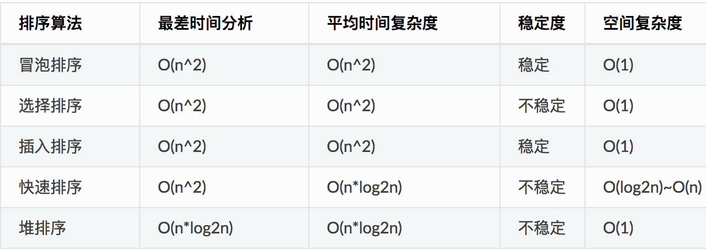

#### **排序算法中的稳定性**

**什么是排序算法的稳定性？**

- 相同大小的元素在排序之后依然保持相对位置不变，就是稳定的
- r[i]=r[j] 且 r[i]在r[j] 之前，排序之后 r[i] 依然在 r[j] 之前
- 稳定性对于排序一个复杂结构，并且需要保持原有排序才有意义

#### 请写出快速排序

**快排经常问：分治法(divide and conquer)，快排三步走**

- Partition: 选择基准分割数组为两个子数组，小于基准和大于基准的
- 对两个子数组分别快排
- 合并结果

```python
def quicksort(array):
    if len(array) < 2:  # 递归出口，空数组或者只有一个元素的数组都是有序的
        return array
    else:
        pivot_index = 0  # 选择第一个元素作为主元 pivot
        pivot = array[pivot_index]
        less_part = [i for i in array[pivot_index+1:] if i <= pivot]
        great_part = [i for i in array[pivot_index+1:] if i >= pivot]
        return quicksort(less_part) + [pivot] + quicksort(great_part)
```

#### 合并两个有序数组

**合并两个有序数组，要求 a[n], b[m], O(n+m)**

```python
def merge_sorted_list(sorted_a, sorted_b):
    """合并两个有序序列，返回一个新的有序序列"""
    length_a, length_b = len(sorted_a), len(sorted_b)
    a = b = 0
    new_sorted_seq = list()

    while a < length_a and b < length_b:
        if sorted_a[a] < sorted_b[b]:
            new_sorted_seq.append(sorted_a[a])
            a += 1
        else:
            new_sorted_seq.append(sorted_b)
            b += 1

    # 最后别忘记把多余的都放到有序数组里
    while a < length_a:
        new_sorted_seq.append(sorted_a[a])
    while b < length_b:
        new_sorted_seq.append(sorted(b))
    return new_sorted_seq
```

#### 请实现堆排序

**短时间内实现堆还是有困难的，但可以借助heapq模块快速实现**

```python
def heapsort_use_heapq(iterable):
    from heapq import heappush, heappop
    items = []
    for value in iterable:
        heappush(items, value)
    return [heappop(items) for i in range(len(items))]
```

#### **请写出二分查找**

**二分经常让手写，注意边界（其实python有个bisect模块)**

```python
def binary_search(sorted_array, val):
    if not sorted_array:
        return -1

    beg = 0
    end = len(sorted_array) - 1
    while beg <= end:
        mid = int((beg + end)/2)  # beg + (end-beg)/2,为了屏蔽python2/3差异我用了强制转换
        if sorted_array[mid] == val:
            return mid
        elif sorted_array[mid] > val:
            end = mid - 1
        else:
            beg = mid + 1
    return -1
```

**递归方式实现二分，注意递归出口**

```python
def binary_search_recursive(sorted_array, beg, end, val):
    if beg >= end:
        return -1
    mid = int((beg + end) / 2)  # beg + (end-beg)/2
    if sorted_array[mid] == val:
        return mid
    elif sorted_array[mid] > val:
        # 注意我依然假设beg，end区间是左闭右开的
        return binary_search_recursive(sorted_array, beg, mid, val)
    else:
        return binary_search_recursive(sorted_array, mid + 1, end, val)
```


### Python数据结构常考题

####  Python web后端常考数据结构

- 常见的数据结构链表、队列、栈、二叉树、堆
- 使用内置结构实现高级数据结构，比如内置的 list/deque 实现栈
- Leetcode 或者《剑指offer》上的常见题

#### 常考数据结构之链表

**链表有单链表、双链表、循环双端链表**

- 如何使用 Python 来表示链表结构
- 实现链表常见操作，比如插入节点，反转链表，合并多个链表等
- Leetcode 练习常见链表题目

#### 常考数据结构之队列

**队列(queue)是先进先出结构**

- 如何使用 Python 实现队列？
- 实现队列的 apend 和 pop 操作，如何做到先进先出
- 使用 Python 的 list 或者 collections.deque 实现队列

#### 常考数据结构之栈

**栈(stack)是后进先出结构**

- 如何使用 Python 实现栈？

- 实现栈的 push 和 pop 操作，如何做到后进先出

- 同样可以用 Python list 或者 collections.deque 实现栈

**借助内置的数据结构非常容易实现一个栈(Stack)，后入先出**

```python
from collections import deque
class Stack(object):
    def __init__(self):
        self.deque = deque()  # 或者用list

    def push(self, value):
        self.deque.append(value)

    def pop(self):
        return self.deque.pop()
```

#### 常考数据结构之字典与集合

**Python dict/set底层都是哈希表**

- 哈希表的实现原理，底层其实就是一个数组

- 根据哈希函数快速定位一个元素，平均查找 O(1)，非常快

- 不断加入元素会引起哈希表重新开辟空间，拷贝之前元素到新数组

#### 哈希表如何解决冲突

**链接法和开放寻址法**

- 元素key冲突之后使用一个链表填充相同key 的元素

- 开放寻址法是冲突之后根据一种方式(二次探查)寻找下一个可用的槽

- cpython使用的二次探查

#### 常考数据结构之二叉树

**先序、中序、后序遍历**

- 先(根)序：先处理根，之后是左子树，然后是右子树

- 中(根)序：先处理左子树，然后是跟，然后是右子树

- 后(根)序：先处理左子树，然后是右子树，最后是根

#### 树的遍历方式

**先序遍历，其实很简单，递归代码里先处理根就好了**

```python
class BinTreeNode(object):
    def __init__(self, data, left=None, right=None):
        self.data, self.left, self.right = data, left, right

class BinTree(object):
    def __init__(self, root=None):
        self.root = root

    def preorder_trav(self, subtree):
        """ 先（根）序遍历 """
        if subtree is not None:
            print(subtree.data)  # 递归函数里先处理根
            self.preorder_trav(subtree.left)  # 递归处理左子树
            self.preorder_trav(subtree.right)  # 递归处理右子树
```

**中序遍历，调整下把 print(subtree.data) 放中间就好啦**

```python
def inorder_trav(self, subtree):
    if subtree is not None:
        self.preorder_trav(subtree.left)
        print(subtree.data)  # 中序遍历放到中间就好啦
        self.preorder_trav(subtree.right)
```

#### 常考数据结构之堆

**堆其实是完全二叉树，有最大堆和最小堆**

- 最大堆：对于每个非叶子节点V，V 的值都比它的两个孩子大
- 最大堆支持每次 pop 操作获取最大的元素，最小堆获取最小元素
- 常见问题：用堆来完成 topk 问题，从海量数字中寻找最大的 k 个

#### 常考数据结构之链表

**链表涉及到指针操作较为复杂，容易出错，经常用作考题**

- 熟悉链表的定义和常见操作

- 常考题：删除一个链表节点

- 常考题：合并两个有序链表

**多写多练**

**找到相关的题目，多做一些练习**

- 一般可能一次很难写对
- 尝试自己先思考，先按照自己的方式编写代码，提交后发现问题
- 如果实在没有思路或者想参考别人的思路可以搜题解

#### 常考数据结构之二叉树

**二叉树涉及到递归和指针操作，常结合递归考察**

- 二叉树的操作很多可以用递归的方式解决，不了解递归会比较吃力
- 常考题：二叉树的镜像
- 常考题：如何层序遍历二叉树（广度优先）

### Python白板编程(手写代码)

#### 什么是白板编程

**传说中的手写算法题，白纸或者白板上手写代码**

- 对于没有参加过ACM/蓝桥杯之类算法竞赛的同学比较吃亏
- 刷题。LeetCode，《剑指offer》，看 github 题解
- 最近某大型互联网公司多年经验跳槽出来因为算法题面挂小公司

#### 为啥要手写算法题

**工作用不到，为啥还要考？**

- 有些公司为了筛选编程能力强的同学，近年来对算法要求越来越高

- 针对刚出校门的同学问得多，有经验的反而算法考得少(偏工程经验)

- 竞争越来越激烈，大家水平差不多的优先选取有算法竞赛经验的

#### 如何准备

**没有太多好的方式，刷常见题。防止业务代码写多了算法手生**

- 刷题，LeetCode 常见题。看《剑指offer》之类的面试算法书
- 面试之前系统整理之前做过的题目，不要靠记忆而是真正理解掌握
- 打好基础是重点，面试可以刷常见题突击，保持手感

#### 面试前练习

**刷题（leetcode+剑指offer+看面经）**

- 《剑指offer》上常见题目用 Python 实现

- 把 leetcode 上常见分类题目刷一遍（github 搜 leetcode 分类）

- 常见排序算法和数据结构能手写

#### 不会怎么办

**针对没有算法竞赛经验的同学**

- 有些公司是硬性标准，想要筛选参加过算法竞赛的同学
- 问面试官这种题目工作中的使用场景，还是想仅仅刁难你
- 如果不会可以一点一点和面试官交流，解释下自己这方面较薄弱

#### 反转链表

**链表在面试中是一个高频考点(leetcode reverse-linked-list)**

- 如何反转一个单链表?
- 你能使用循环的方式实现吗？
- 能否用递归的方式实现？

### 面向对象基础及Python 类常考问题

#### 什么是面向对象编程？

**Object Oriented Programming(OOP)**

- 把对象作为基本单元，把对象抽象成类(Class)，包含成员和方法
- 数据封装、继承、多态
- Python 中使用类来实现

#### Python中如何创建类？

```python
class Person(object):  # py3 直接class person
    def __init__(self, name, age):
        self.name = name
        self.age = age

    def print_name(self):
        print('my name is {}'.format(self.name))
```

#### 组合与继承

**优先使用组合而非继承**

- 组合是使用其他的类实例作为自己的一个属性(Has-a 关系)

- 子类继承父类的属性和方法(Is a 关系)

- 优先使用组合保持代码简单

#### 类变量和实例变量的区别

**区分类变量和实例变量** 

- 类变量由所有实例共享
- 实例变量由实例单独享有，不同实例之间不影响
- 当我们需要在一个类的不同实例之间共享变量的时候使用类变量


#### classmethod/staticmethod区别

**classmethod vs staticmethod**

- 都可以通过 Class.method() 的方式使用

- classmethod第一个参数是 cls，可以引用类变量

- staticmethod使用起来和普通函数一样，只不过放在类里去组织

#### 什么是元类？使用场景

**元类(Meta Class)是创建类的类**

- 元类允许我们控制类的生成，比如修改类的属性等
- 使用 type 来定义元类
- 元类最常见的一个使用场景就是 ORM 框架

### Python装饰器常见考题

#### 什么是装饰器

**Decorator**

- Python中一切皆对象，函数也可以当做参数传递
- 装饰器是接受函数作为参数，添加功能后返回一个新函数的函数(类)
- Python 中通过@使用装饰器

#### 编写一个记录函数耗时的装饰器

```python
import time

def log_time(func):
    def _log(*args, **kwargs):
        beg = time.time()
        res = func(*args, **kwargs)
        print('use time: {}'.format(time.time() - beg))
        return res
    return _log

@log_time
def mysleep():
    time.sleep(1)

mysleep()
```

#### 如何使用类编写装饰器？

```python
import time

class LogTime:
    def __call__(self, func):
        def _log(*args, **kwargs):
            beg = time.time()
            res = func(*args, **kwargs)
            print('use time: {}'.format(time.time() - beg))
            return res
        return _log

@LogTime()
def mysleep2():
    time.sleep(1)

mysleep2()
```

#### 如何给装饰器增加参数？

**使用类装饰器比较方便实现装饰器参数**

```python
import time

class LogTimeParams:
    def __init__(self, use_int=False):
        self.use_int = use_int

    def __call__(self, func):
        def _log(*args, **kwargs):
            beg = time.time()
            res = func(*args, **kwargs)
            if self.use_int:
                print('use time: {}'.format(int(time.time() - beg)))
            else:
                print('use time: {}'.format(time.time() - beg))
            return res
        return _log
```

### 设计模式：创建型模式

常见创建型设计模式

- 工厂模式(Factory)：解决对象创建问题
- 构造模式(Builder): 控制复杂对象的创建
- 原型模式(Prototype)：通过原型的克隆创建新的实例
- 单例(Borg/Singleton): 一个类只能创建同一个对象
- 对象池模式(Pool): 预先分配同一类型的一组实例
- 惰性计算模式(Lazy Evaluation)：延迟计算(python 的property)

#### 工厂模式

**什么是工厂模式(Factory)**

- 解决对象创建问题

- 解耦对象的创建和使用

- 包括工厂方法和抽象工厂


#### 构造模式

**什么是构造模式(Builder)**

- 用来控制复杂对象的构造

- 创建和表示分离。比如你要买电脑，工厂模式直接给你需要的电脑

- 但是构造模式允许你自己定义电脑的配置，组装完成后给你

#### 原型模式

**什么是原型模式（****Prototype)**

- 通过克隆原型来创建新的实例

- 可以使用相同的原型，通过修改部分属性来创建新的示例

- 用途：对于一些创建实例开销比较高的地方可以用原型模式

#### 单例模式

**单例模式的实现有多种方式**

- 单例模式：一个类创建出来的对象都是同一个
- Python的模块其实就是单例的，只会导入一次
- 使用共享同一个实例的方式来创建单例模式

### 设计模式：结构型模式

**常见结构型设计模式**

- 装饰器模式(Decorator): 无需子类化扩展对象功能
- 代理模式(Proxy): 把一个对象的操作代理到另一个对象
- 适配器模式(Adapter)：通过一个间接层适配统一接口
- 外观模式(Facade): 简化复杂对象的访问问题
- 享元模式(Flyweight): 通过对象复用(池)改善资源利用，比如连接池
- Model-View-Controller(MVC)：解耦展示逻辑和业务逻辑

#### 代理模式

**什么是代理模式（Proxy)**

- 把一个对象的操作代理到另个一对象

- 这里又要提到我们之前实现的Stack/Queue，把操作代理到 deque

- 通常使用 has-a 组合关系

#### 适配器模式

**什么是适配器模式 (Adapter)**

- 把不同对象的接口适配到同一个接口
- 想象一个多功能充电头，可以给不同的电器充电，充当了适配器
- 当我们需要给不同的对象统一接口的时候可以使用适配器模式

### 设计模式：行为型模式

**常见学习行为型设计模式**

- 迭代器模式(Iterator): 通过统一的接口迭代对象 

- 观察者模式(Observer):对象发生改变的时候，观察者执行相应动作

- 策略模式(Strategy): 针对不同规模输入使用不同的策略 

#### 迭代器模式

- Python内置对迭代器模式的支持

- 比如我们可以用 for 遍历各种 Iterable 的数据类型

- Python里可以实现 __next__ 和 __iter__ 实现迭代器 

#### 观察者模式

- 发布订阅是一种最常用的实现方式

- 发布订阅用于解耦逻辑

- 可以通过回调等方式实现，当发生事件时，调用相应的回调函数

#### 策略模式

- 根据不同的输入采用不同的策略
- 比如买东西超过10个打八折，超过20个打七折
- 对外暴露统一的接口，内部采用不同的策略计算


### 函数式编程

**Python****支持部分函数式编程特性**

- 把电脑的运算视作数学上的函数计算 (lambda 演算) 

- 高阶函数: map/reduce/filter

- 无副作用，相同的参数调用始终产生同样的结果 

### 什么是闭包？

**Closure**

- 绑定了外部作用域的变量的函数 
- 即使程序离开外部作用域，如果闭包仍然可见，绑定变量不会销毁
- 每次运行外部函数都会重新创建闭包 


### 单例模式手写

**单例模式有多种方式来实现**

- 之前我们使用过 __new__ 的方式实现了单例模式
- 你能使用类装饰器来完成单例模式么？
- 小提示：装饰器既可以接受一个函数，也可以是一个类(都是对象)


### Linux命令

#### 为什么要学Linux？

**大部分企业应用跑在 linux server上**

- 熟练在 Linux 服务器上操作 

- 了解 Linux 工作原理和常用工具

- 需要了解查看文件、进程、内存相关的一些命令，用来调试和排查 

#### 如何查询linux命令的用法

**linux命令众多，如何知道一个命令的用法**

- 使用 man 命令查询用法。但是 man 手册比较晦涩 
- 使用工具自带的help，比如 pip --help
- 这里介绍一个man 的替代工具 tldr。Pip install tldr 

#### 文件/目录操作命令

**掌握常见的文件操作工具**

- chown/chmod/chgrp 

- ls/rm/cd/cp/mv/touch/rename/ln(软链接和硬链接) 等

- locate/find/grep 定位查找和搜索

#### 文件查看

**文件或者日志查看工具**

- 编辑器 vi/nano 

- cat/head/tail 查看文件

- more/less 交互式查看文件


#### 进程操作命令

**掌握常见的进程操作工具**

- ps 查看进程

- kill 杀死进程

- top/htop 监控进程

#### 内存操作命令

**掌握常见的内存操作工具**

- free 查看可用内存 

-  了解每一列的具体含义

- 排查内存泄露问题 

#### 网络操作命令

- ifconfig 查看网卡信息 
- lsof/netstat 查看端口信息
- ssh/scp 远程登录/复制。tcpdump 抓包 


#### 用户/组操作命令

- useradd/usermod 

- groupadd/groupmod

#### 学习linux命令

- man 命令可以查询用法。或者 cmd --help 
- 《鸟哥的 linux 私房菜》，学习简单的 shell 脚本知识
- 多用才能熟悉 


### 操作系统线程和进程

#### 进程和线程的区别

- 进程是对运行时程序的封装，是系统资源调度和分配的基本单位 
- 线程是进程的子任务, cpu 调度和分配的基本单位，实现进程内并发
- 一个进程可以包含多个线程，线程依赖进程存在，并共享进程内存 

#### 什么是线程安全

**Python哪些操作是线程安全的？**

- 一个操作可以在多线程环境中安全使用，获取正确的结果 
- 线程安全的操作好比线程是顺序执行而不是并发执行的(i += 1)
- 一般如果涉及到写操作需要考虑如何让多个线程安全访问数据 

#### **线程同步的方式**

**了解线程同步的方式，如何保证线程安全**

- 互斥量（锁）: 通过互斥机制防止多个线程同时访问公共资源 
- 信号量(Semphare):控制同一时刻多个线程访问同一个资源的线程数
- 事件(信号): 通过通知的方式保持多个线程同步

#### 进程间通信的方式

**Inter-Process Communication 进程间传递信号或者数据**

- 管道/匿名管道/有名管道(pipe) 
- 信号(Signal): 比如用户使用Ctrl+c 产生 SIGINT 程序终止信号
- 消息队列 (Message)
- 共享内存(share memory) 
- 信号量(Semaphore)
- 套接字 (socket)：最常用的方式，我们的 web 应用都是这种方式

#### Python中如何使用多线程

**threading模块**

- threading.Thread 类用来创建线程
- start() 方法启动线程
- 可以用 join() 等待线程结束 

#### Python中如何使用多进程

**Python有GIL，可以用多进程实现cpu密集程序**

- multiprocessing 多进程模块
- Multiprocessing.Process 类实现多进程
- 一般用在 cpu 密集程序里，避免 GIL 的影响 


### 操作系统内存管理机制常见考题

#### 什么是分页机制

**逻辑地址和物理地址分离的内存分配管理方案**

- 程序的逻辑地址划分为固定大小的页(Page) 
- 物理地址划分为同样大小的帧(Frame)
- 通过页表对应逻辑地址和物理地址 

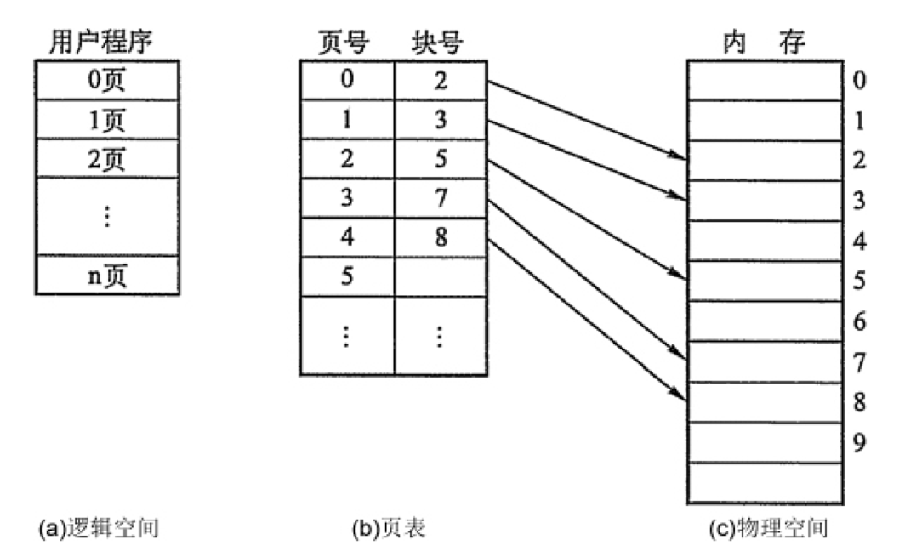

#### 什么是分段机制

**分段是为了满足代码的一些逻辑需求**

- 数据共享，数据保护，动态链接等 

- 通过段表实现逻辑地址和物理地址的映射关系

- 每个段内部是连续内存分配，段和段之间是离散分配的

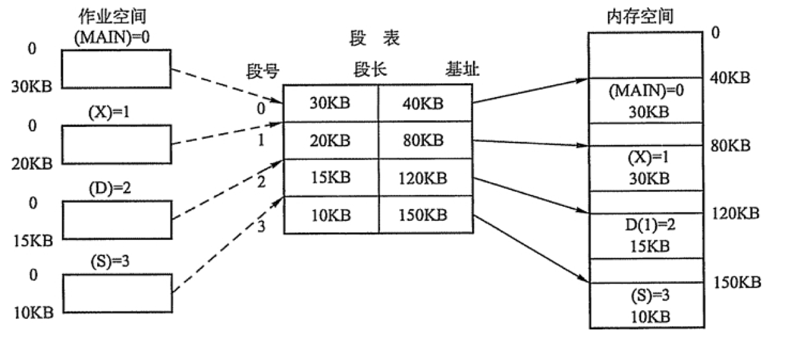

#### 分页和分段的区别

- 页是出于内存利用率的角度提出的离散分配机制 
- 段是出于用户角度，用于数据保护、数据隔离等用途的管理机制
- 页的大小是固定的，操作系统决定；段大小不确定，用户程序决定

#### 什么是虚拟内存

**通过把一部分暂时不用的内存信息放到硬盘上**

- 局部性原理，程序运行时候只有部分必要的信息装入内存 

- 内存中暂时不需要的内容放到硬盘上

- 系统似乎提供了比实际内存大得多的容量，称之为虚拟内存

#### 什么是内存抖动（颠簸）

**本质是频繁的页调度行为**

- 频繁的页调度，进程不断产生缺页中断 
- 置换一个页，又不断再次需要这个页
- 运行程序太多；页面替换策略不好。终止进程或者增加物理内存

#### Python的垃圾回收机制原理？

**Python无需我们手动回收内存？它的垃圾回收是如何实现的呢？**

- 引用计数为主（缺点：循环引用无法解决） 
- 引入标记清除和分代回收解决引用计数的问题
- 引用计数为主+标记清除和分代回收为辅

#### 多线程爬虫

**如何使用Python的threading模块**

- 请你使用 Python 的 Threading 模块完成一个多线程爬虫类
- 要求1：该类可以传入最大线程数和需要抓取的网址列表
- 要求2：该类可以通过继承的方式提供一个处理 response 的方法


### 网络协议TCP/UDP

#### 浏览器输入一个url中间经历的过程

**一个常见的考题，要回答全面不容易**

- 中间涉及到了哪些过程 

- 包含哪些网络协议

- 每个协议都干了什么？ 


#### TCP三次握手过程

**TCP三次握手，状态转换。用wireshark抓包更直观**


#### TCP四次挥手过程

**TCP四次挥手，状态转换**

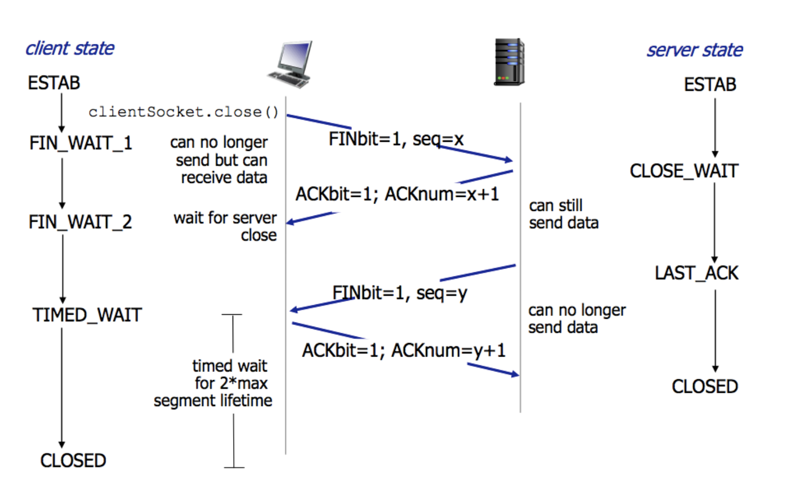

#### TCP/UDP的区别

**TCP vs UDP**

- 面向连接、可靠的、基于字节流 

- 无连接、不可靠、面向报文

- 不同的场景 

### HTTP协议常考题

#### HTTP请求的组成

**HTTP协议由哪些部分组成？使用抓包工具去查看和理解**

- 状态行  

- 请求头

- 消息主体

#### HTTP响应的组成

**HTTP协议由哪些部分组成？使用抓包工具去查看和理解**

- 状态行 

- 响应头

- 响应正文

#### HTTP常见状态码

- 1** 信息。服务器收到请求，需要请求者继续执行操作 

- 2** 成功。操作被成功接受并处理

- 3** 重定向。需要进一步操作完成请求

- 4** 客户端错误。请求有语法错误或者无法完成请求 

- 5** 服务器错误。服务器在处理请求的过程中发生错误

#### HTTP GET/POST 区别

**HTTP GET VS POST**

- Restful 语义上一个是获取，一个是创建 
- GET 是幂等的，POST 非幂等
- GET请求参数放到url(明文),长度限制；POST 放在请求体，更安全

#### 什么是幂等性

**什么是幂等？哪些HTTP方法是幂等的**

- 幂等方法是无论调用多少次都得到相同结果的 HTTP 方法 
- 例如： a=4 是幂等的，但是 a += 4 就是非幂等的
- 幂等的方法客户端可以安全地重发请求

#### 幂等方法


#### 什么是HTTP长连接

**HTTP persistent connection, HTTP 1.1**

- 短连接：建立连接…数据传输…关闭连接(连接的建立和关闭开销大) 
- 长连接：Connection: Keep-alive。保持 TCP 连接不断开 
- 如何区分不同的 HTTP 请求呢？Content-Length | Transfer-Encoding: chunked

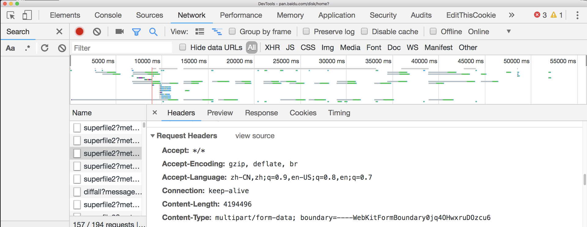

#### cookie和session区别

**HTTP是无状态的，如何识别用户呢？**

- Session 一般是服务器生成之后给客户端（通过 url 参数或cookie) 

- Cookie 是实现 session 的一种机制，通过 HTTP cookie 字段实现

- Session通过在服务器保存 sessionid 识别用户，cookie 存储在客户端

#### HTTP重点内容

- 请求和响应的组成 
- 常用 HTTP 方法和幂等性
- 长连接；session 和 cookie


### 网络编程常考题

#### TCP/UDP socket 编程；HTTP编程

- 了解TCP编程的原理 
- 了解UDP编程的原理
- 了解如何发送HTTP请求 

#### **TCP socket** **编程原理？**

**了解TCP socket编程原理**

- 如何使用 socket 模块 

- 如何建立 TCP socket 客户端和服务端

- 客户端和服务端之间的通信 

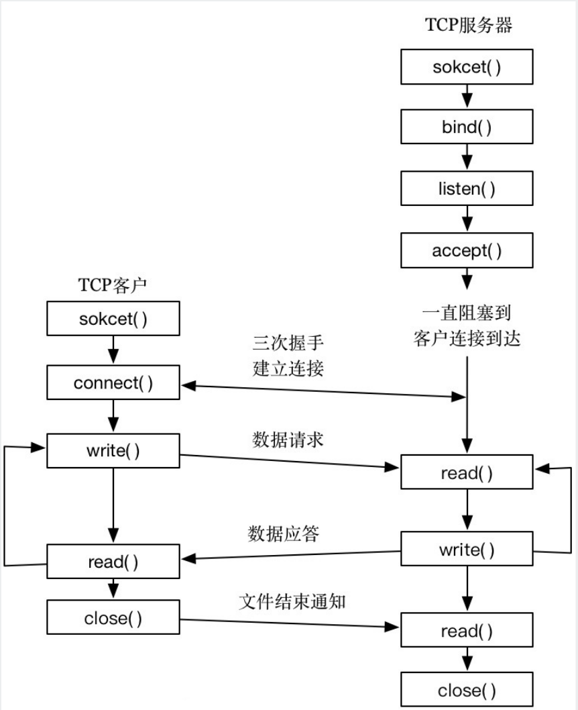

#### 使用socket发送HTTP请求

**如何使用socket发送HTTP请求**

- 使用 socket 接口发送 HTTP 请求 
- HTTP建立在TCP基础之上
- HTTP是基于文本的协议 

### IO多路复用常考题

#### 五种IO模型

**Unix网络编程中提到了5种网络模型**

- Blocking IO 

- Nonblocking IO

- IO multiplexing 

**两种不常用**

- Signal Driven IO 
- Asynchronous IO
- 这两种不常用，一般使用 IO 多路复用比较多 

#### 如何提升并发能力

**一些常见的提升并发能力的方式**

- 多线程模型，创建新的线程处理请求 
- 多进程模型，创建新的进程处理请求
- IO多路复用，实现单进程同时处理多个 socket 请求 

#### 什么是IO多路复用？

**操作系统提供的同时监听多个socket的机制**

- 为了实现高并发需要一种机制并发处理多个 socket 

- Linux 常见的是 select/poll/epoll

- 可以使用单线程单进程处理多个 socket

#### 阻塞式 IO


#### **什么是** **IO** **多路复用？**

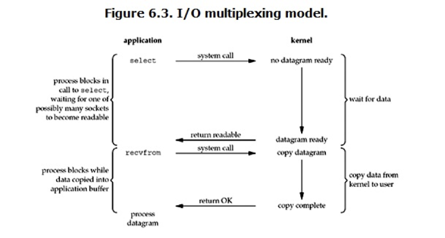

```python
while True:
    events = sel.select()
    for key, mask in events:
        callback = key.data
        callback(key.fileobj, mask)
```

#### select/poll/epoll区别

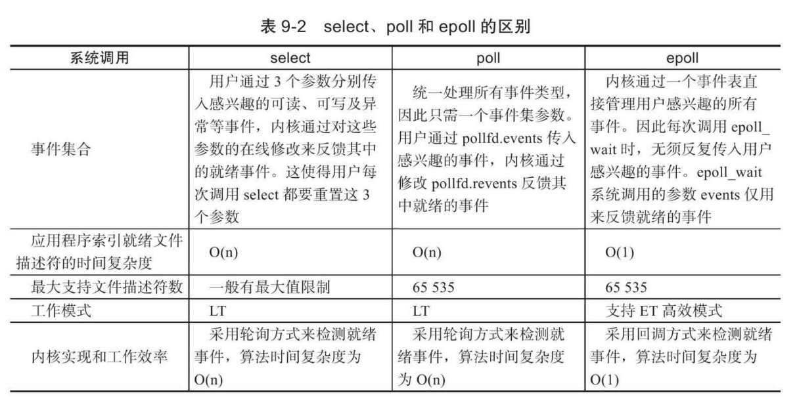

#### Python如何实现IO多路复用?

**Python封装了操作系统的IO多路复用**

- Python 的IO多路复用基于操作系统实现(select/poll/epoll) 
- Python2 select 模块 
- Python3 selectors 模块 

**selector模块**

事件类型：EVENT_READ, EVENT_WRITE

DefaultSelector: 自动根据平台选取合适的IO模型

- register(fileobj, events, data=None)
- unregister(fileobj)
- modify(fileobj, events, data=None)
- select(timeout=None): returns[(key, events)]
- close()

### Python并发网络库常考题

#### 你用过哪些并发网络库？

 **Tornado vs Gevent vs Asyncio**

- Tornado 并发网络库和同时也是一个web微框架 

- Gevent 绿色线程(greenlet) 实现并发，猴子补丁修改内置 socket

- Asyncio Python3 内置的并发网络库，基于原生协程 

#### Tornado框架

**Tornado适用于微服务，实现Restful接口**

- 底层基于Linux 多路复用
- 可以通过协程或者回调实现异步编程
- 不过生态不完善，相应的异步框架比如ORM不完善

#### Gevent

**高性能的并发网络库**

- 基于轻量级绿色线程(greenlet)实现并发
- 需要注意 monkey patch，gevent 修改了内置的socket改为非阻塞
- 配合 gunicorn 和 gevent 部署作为 wsgi server

#### Asyncio

**基于协程实现的内置并发网络库**

- Python3 引入到内置库， 协程+事件循环
- 生态不够完善，没有大规模生产环境检验
- 目前应用不够广泛，基于 Aiohttp 可以实现一些小的服务

**TCP；HTTP；socket编程；IO多路复用；并发网络库**

- TCP 和 HTTP 是重点和常考点
- 了解socket 编程原理有助于我们理解框架的实现
- 并发网络库底层一般都是基于 IO 多路复用实现

#### 编写一个异步爬虫类

**使用Python的gevent或者asyncio编写一个异步爬虫类**

- 你可以选择使用 gevent 或者 asyncio(推荐)，编写一个异步爬虫类

- 要求1：该类可以传入需要抓取的网址列表

- 要求2：该类可以通过继承的方式提供一个处理 response 的方法

### MySQL基础常考题

#### MySQL基础考点

- 事务的原理，特性，事务并发控制

- 常用的字段、含义和区别

- 常用数据库引擎之间区别 

#### 什么是事务

**Transaction**

- 事务是数据库并发控制的基本单位 

- 事务可以看作是一系列SQL语句的集合

- 事务必须要么全部执行成功，要么全部执行失败（回滚） 

**Transaction示例**

```mysql
session.begin
try:
		item1 = session.query(Item).get(1)
		item2 = session.query(Item).get(2)
		item1.foo = 'bar'
		item2.bar = 'foo'
		session.commit()
except:
		session.rollback()
		raise
```

#### 事务的ACID特性

**ACID是事务的四个基本特性**

- 原子性(Atomicity)：一个事务中所有操作全部完成或失败

- 一致性(Consistency): 事务开始和结束之后数据完整性没有被破坏

- 隔离性(Isolation): 允许多个事务同时对数据库修改和读写 

- 持久性(Durability)：事务结束之后，修改是永久的不会丢失

#### 事务的并发控制可能产生哪些问题

**如果不对事务进行并发控制，可能会产生四种异常情况**

- 幻读(phantom read):一个事务第二次查出现第一次没有的结果

- 非重复读(nonrepeatable read):一个事务重复读两次得到不同结果 

- 脏读(dirty read):一个事务读取到另一个事务没有提交的修改 

- 丢失修改(lost update): 并发写入造成其中一些修改丢失 

#### 四种事务隔离级别

**为了解决并发控制异常，定义了4种事务隔离级别**

- 读未提交(read uncommitted):别的事务可以读取到未提交改变
- 读已提交(read committed):只能读取已经提交的数据  
- 可重复读(repeatable read):同一个事务先后查询结果一样
- 串行化(Serializable): 事务完全串行化的执行，隔离级别最高，执行效率最低

#### 如何解决高并发场景下的插入重复

**高并发场景下，写入数据库会有数据重复问题**

- 使用数据库的唯一索引 
- 使用队列异步写入
- 使用 redis 等实现分布式锁

#### 乐观锁和悲观锁

**什么是乐观锁，什么是悲观锁**

- 悲观锁是先获取锁再进行操作。一锁二查三更新 select for update 

- 乐观锁先修改,更新的时候发现数据已经变了就回滚(check and set)

- 使需要根据响应速度、冲突频率、重试代价来判断使用哪一种

#### Mysql常用数据类型-字符串(文本)


#### Mysql常用数据类型-数值

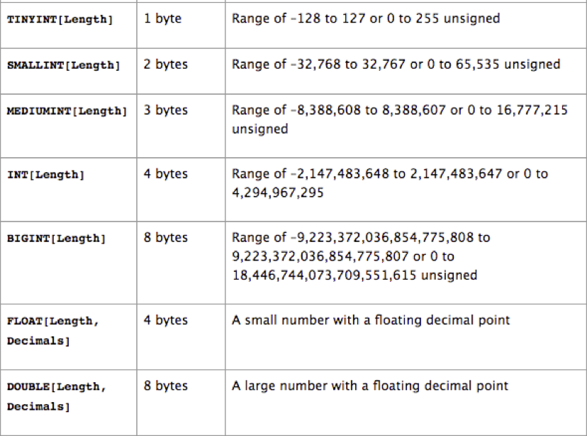

#### Mysql常用数据类型-日期和时间


#### InnoDB vs MyISAM

**两种引擎常见的区别**

- MyISAM不支持事务 ，InnoDB支持事务
- MyISAM不支持外键，InnoDB支持外键
- MyISAM只支持表锁，InnoDB支持行锁和表锁

### Mysql索引原理及优化常见考题

#### 考点聚焦

**Mysql索引**

- 索引的原理、类型、结构 

- 创建索引的注意事项，使用原则

- 如何排查和消除慢查询

#### 什么是索引

**为什么需要索引？**

- 索引是数据表中一个或者多个列进行排序的数据结构 
- 索引能够大幅提升检索速度(回顾下你所知道的查找结构)
- 创建、更新索引本身也会耗费空间和时间 

#### 什么是B-Tree

**什么是B-Tree，为什么要使用B-Tree**

- 多路平衡查找树(每个节点最多 m(m>=2)个孩子,称为m 阶或者度) 

- 叶节点具有相同的深度

- 节点中的数据 key 从左到右是递增的 


#### B+Tree

**B+树是B-Tree的变形**

- Mysql 实际使用的 B+Tree作为索引的数据结构
- 只在叶子节点带有指向记录的指针 (为什么？可以增加树的度)
- 叶子结点通过指针相连。为什么？实现范围查询 


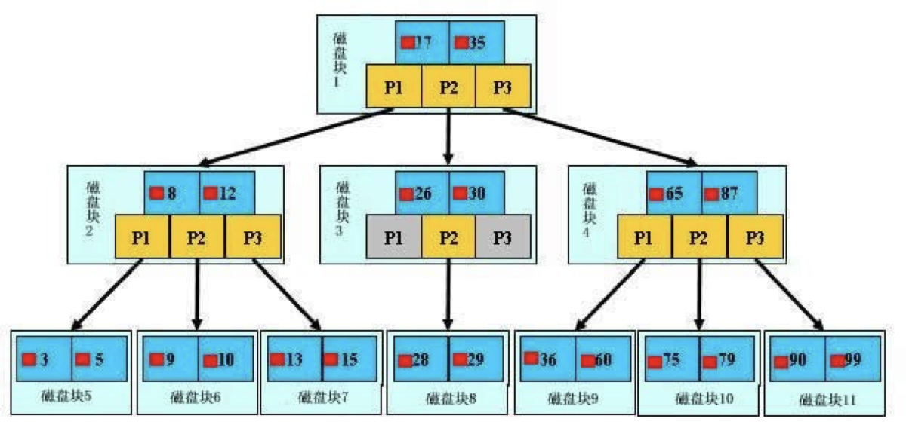

#### Mysql索引的类型

 **Mysql创建索引类型**

- 普通索引 (CREATE INDEX)
- 唯一索引，索引列的值必须唯一 (CREATE UNIQUE INDEX)
- 多列索引 
- 主键索引 (PRIMARY KEY)，一个表只能有一个
- 全文索引（FULLTEXT INDEX)，InnoDB 不支持

#### 什么时候创建索引？

**建表的时候需要根据查询需求来创建索引**

- 经常用作查询条件的字段(WHERE条件) 

- 经常用作表连接的字段

- 经常出现在 order by, group by 之后的字段

#### 创建索引有哪些需要注意的？

**最佳实践**

- 非空字段 NOT NULL，Mysql 很难对空值作查询优化

- 区分度高，离散度大，作为索引的字段值尽量不要有大量相同值

- 索引的长度不要太长(比较耗费时间) 

#### 索引什么时候失效

**记忆口诀：模糊匹配、类型隐转、最左匹配**

- 以 % 开头的 LIKE 语句，模糊搜索
- 出现隐式类型转换（在 Python 这种动态语言查询中需要注意）
- 没有满足最左前缀原则（想想为什么是最左匹配？） 

#### 聚集索引和非聚集索引

**什么是聚集索引？什么是非聚集索引？**

- 聚集还是非聚集指的是B+Tree 叶节点存的是指针还是数据记录
- MyISAM索引和数据分离，使用的是非聚集索引
- InnoDB数据文件就是索引文件，主键索引就是聚集索引 

**非聚集索引**


**非聚集和聚集索引的文件存储方式**

```mysql
CREATE TABLE myisam_table(
  `id` INTEGER PRIMARY KEY,
  title VARCHAR(80)
) ENGINE = MYISAM;

CREATE TABLE innodb_table(
  `id` INTEGER PRIMARY KEY,
  title VARCHAR(80)
  KEY `idx_url` (`url_md5`)
) ENGINE = InnoDB;
```


**聚集索引**

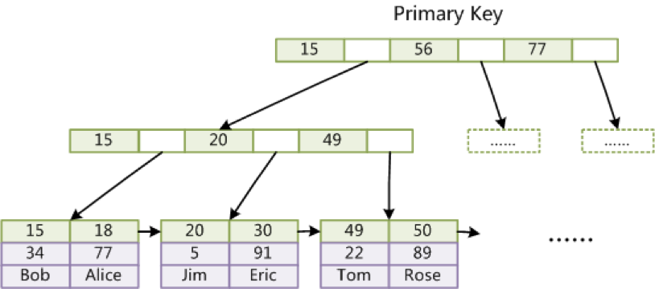


**聚集索引与辅助索引**

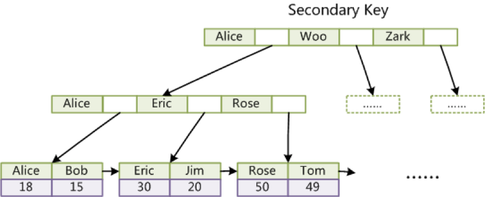


#### 如何排查慢查询

**慢查询通常是缺少索引，索引不合理或者业务代码实现导致**

- slow_query_log_file 开启并且查询慢查询日志 

- 通过 explain 排查索引问题

- 调整数据修改索引；业务代码层限制不合理访问

#### 索引的原理是重点

- 索引的原理 
- B+Tree 的结构
- 不同索引的区别


### SQL语句编写常考题

#### 考点聚焦

**SQL语句以考察各种常用连接为重点**

- 内连接(INNER JOIN)：两个表都存在匹配时，才会返回匹配行  
- 外连接(LEFT/RIGHT JOIN):返回一个表的行，即使另一个没有匹配
- 全连接(FULL JOIN): 只要某一个表存在匹配就返回 

#### 内连接 INNER JOIN

- 将左表和右表能够关联起来的数据连接后返回  
- 类似于求两个表的“交集”
- select * from A inner join B on a.id=b.id; 

**示例表**

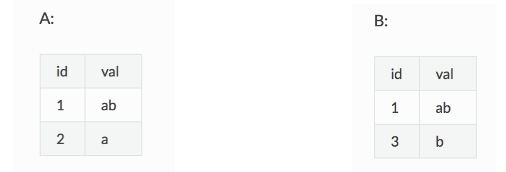

**内连接结果**


#### 外连接

**外连接包含左连接和右连接**

- 左连接返回左表中所有记录，即使右表中没有匹配的记录  
- 右连接返回右表中所有记录，即使左表中没有匹配的记录
- 没有匹配的字段会设置成 NULL 

**左连接结果**

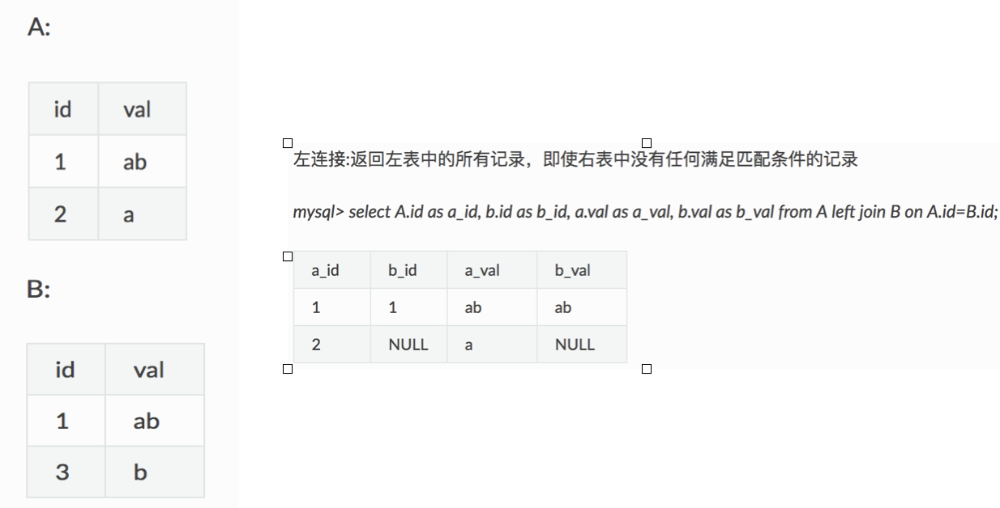

**右连接结果**

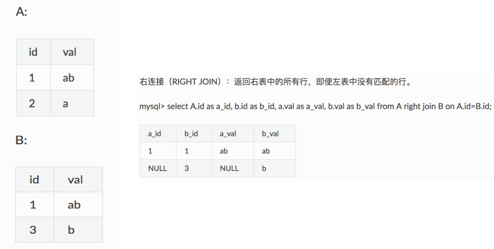

#### 全连接 FULL OUTER JOIN

- 只要某一个表存在匹配，就返回行  
- 类似于求两个表的“并集”
- 但是 Mysql不支持，可以用 left join、union、right join联合使用模拟

**全连接结果**


### 缓存及Redis常考面试题

#### 考点聚焦

**缓存的使用场景；Redis的使用；缓存使用中的坑**

- 为什么要使用缓存？使用场景？ 

- Redis的常用数据类型，使用方式

- 缓存使用问题：数据一致性问题；缓存穿透、击穿、雪崩问题

#### 什么是缓存？为什么要使用缓存？

**本章主要讨论的是内存缓存（常见的有Redis和Memcached)**

- 缓解关系数据库(常见的是Mysql)并发访问的压力：热点数据 

- 减少响应时间：内存 IO 速度比磁盘快

- 提升吞吐量：Redis 等内存数据库单机就可以支撑很大并发 

**操作时间对比**

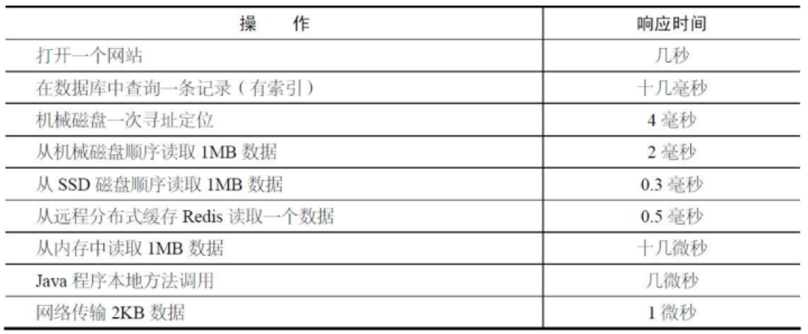

#### Redis和Memcached主要区别?


#### 请简述Redis常用数据类型和使用场景?

**考察对Redis使用的掌握程度**

- String(字符串):用来实现简单的 KV 键值对存储，比如计数器

- List(链表):实现双向链表，比如用户的关注，粉丝列表

- Hash(哈希表): 用来存储彼此相关信息的键值对 

- Set(集合): 存储不重复元素，比如用户的关注者

- Sorted Set(有序集合): 实时信息排行榜 

#### 延伸考点：Redis内置实现

**对于中高级工程师，需要了解Redis各种类型的C底层实现方式**

- String: 整数或者sds(Simple Dynamic String) 
- List: ziplist或者double linked list
- Hash: ziplist 或者 hashtable 
- Set: intset 或者 hashtable  
- SortedSet: skiplist 跳跃表
- 深入学习请参考：《Redis 设计与实现》

#### Redis实现的跳跃表是什么结构？

**Sorted Set为了简化实现，使用skiplist而不是平衡树实现**


#### Redis有哪些持久化方式？

**Redis支持两种方式实现持久化**

- 快照方式：把数据快照放在磁盘二进制文件中，dump.rdb
- AOF(Append Only File)：每一个写命令追加到 appendonly.aof中
- 可以通过修改 Redis 配置实现

#### **什么是Redis事务？**

**和Mysql的事务有什么不同？**

- 将多个请求打包，一次性、按序执行多个命令的机制
- Redis 通过 MULTI, EXEC, WATCH 等命令实现事务功能
- Python redis-py pipeline=conn.pipeline(transaction=True) 

#### Redis如何实现分布式锁？

**Redis如何实现分布式锁？**

- 使用setnx实现加锁，可以同时通过expire添加超时时间
- 锁的 value 值可以使用一个随机的 uuid 或者特定的命名
- 释放锁的时候，通过uuid 判断是否是该锁，是则执行delete释放锁 

#### 使用缓存的模式？

**常用的缓存使用模式**

- Cache Aside: 同时更新缓存和数据库 
- Read/Write Through: 先更新缓存，缓存负责同步更新数据库
- Write Behind Caching: 先更新缓存，缓存定期异步更新数据库 

#### **如何解决缓存穿透问题?**

**大量查询不到的数据的请求落到后端数据库，数据库压力增大**

- 由于大量缓存查不到就去数据库取，数据库也没有要查的数据

- 解决：对于没查到返回为 None 的数据也缓存

- 插入数据的时候删除相应缓存，或者设置较短的超时时间 

#### 如何解决缓存雪崩问题?

**缓存不可用或者大量缓存key同时失效，大量请求直接打到数据库**

- 多级缓存：不同级别的 key 设置不同的超时时间

- 随机超时：key 的超时时间随机设置，防止同时超时

- 架构层：提升系统可用性。监控、报警完善


### Mysql与Redis练习题

#### Mysql索引的理解

- 为什么 Mysql 数据库的主键使用自增的整数比较好？

- 使用 uuid 可以吗？为什么？

- 如果是分布式系统下我们怎么生成数据库的自增 id 呢？ 

#### Redis应用-分布式锁

**Redis的应用之一：实现分布式锁**

- 请你基于 Redis 编写代码实现一个简单的分布式锁

- 要求：支持超时时间参数

- 深入思考：如果 Redis 单个节点宕机了，如何处理？还有其他业界的方案实现分布式锁么？ 

### Python WSGI与web框架常考点

#### 考点聚焦

**WSGI；常见Web框架**

- 什么是 WSGI？ 
- 常用的 Python Web 框架 Django/Flask/Tornado 对比
- Web框架的组成（淡化框架，加强基础）

#### 什么是WSGI？

- Python Web Server Gateway Interface (pep3333)
- 解决 Python Web Server 乱象 mod_python, CGI, FastCGI 等
- 描述了Web Server(Gunicorn/uWSGI)如何与 web 框架(Flask/Django)交互，Web 框架如何处理请求

```
def application(environ, start_response)
```

application就是WSGI app，一个可调用对象

- environ：一个包含WSGI环境信息的字典，由WSGI服务器提供，常见的key有PATH_INFO，QUERY_STRING等
- start_response：生成WSGI响应的回调函数，接收两个参数，status和headers
- 函数返回响应体的可迭代对象

#### 一个简单的兼容WSGI的web应用

```python
def application(environ, start_response):
    status = '200 OK'
    headers = [('Content-Type', 'text/html;charset=utf8')]
    start_response(status, headers)
    return [b"<h1>Hello, World!</h1>"]
```

**运行web应用**

```python
# 导入Python内置的WSGI server
from wsgiref.simple_server import make_server

def application(environ, start_response):
    print(environ)  #  建议打印出这个字典看看有哪些参数
    status = '200 OK'
    headers = [
        ('Content-Type', 'text/html;charset=utf8')
    ]
    start_response(status, headers)
    return [b"<h1>Hello, World2!</h1>"]

if __name__ == '__main__':
    httpd = make_server('127.0.0.1', 8000, application)
    httpd.serve_forever()
```

#### 常用的Python Web框架对比

- Django: 大而全，内置 ORM、Admin 等组件，第三方插件较多 
- Flask:微框架，插件机制，比较灵活
- Tornado:异步支持的微框架和异步网络库

#### 什么是MVC?

**MVC:模型(Model)，视图(View)，控制器(Controller)**

- Model: 负责业务对象和数据库的交互(ORM) 
- View：负责与用户的交互展示
- Controller：接收请求参数调用模型和视图完成请求


#### 什么是ORM？

**Object Relational Mapping，对象关系映射**

- 用于实现业务对象与数据表中的字段映射 
- 优势：代码更加面向对象，代码量更少，提升开发效率
- 缺点：拼接对象比较耗时，有一定性能影响

#### 一个Web框架的组成？

**Web框架一般有哪些组件？**

- 中间件，用于请求之前和请求之后做一些处理（比如记录日志等）
- 路由, 表单验证, 权限认证, ORM, 视图函数, 模板渲染, 序列化 
- 第三方插件：Redis连接，RESTful支持等

#### 什么是Gunicorn？

**Gunicorn: Python WSGI HTTP Server**

- 纯 Python 编写的高性能的 WSGI Server
- pre-fork 预先分配多个 worker 进程处理请求(master-slave) 
- 多种 worker 支持：Sync/Async(Gevent)/Tornado/AsyncIO

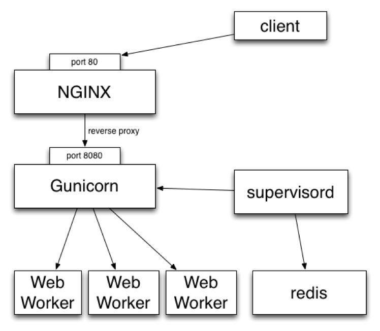

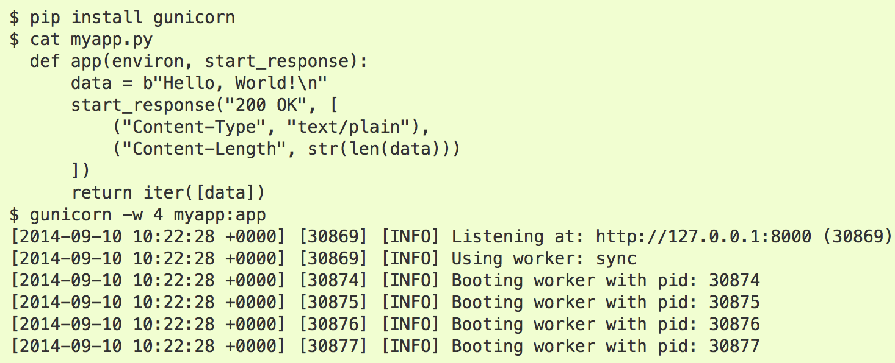

### Web安全常考点

#### 考点聚焦

**常见的web安全问题，原理和防范措施。安全意识**

- SQL注入 

- XSS(跨站脚本攻击, Cross-Site Scripting)

- CSRF(跨站请求伪造, Cross-site request forgery)

#### 什么是SQL注入？

**SQL注入与防范**

- 通过构造特殊的输入参数传入Web应用，导致后端执行了恶意 SQL
- 通常由于程序员未对输入进行过滤，直接动态拼接 SQL 产生
- 可以使用开源工具 sqlmap, SQLninja 检测

#### 如何防范SQL注入？

**web安全一大原则：永远不要相信用户的任何输入**

- 对输入参数做好检查（类型和范围）；过滤和转义特殊字符
- 不要直接拼接 sql，使用 ORM 可以大大降低 sql 注入风险
- 数据库层：做好权限管理配置；不要明文存储敏感信息

#### 什么是XSS？

**XSS(Cross Site Scripting)，跨站脚本攻击**

- 恶意用户将代码植入到提供给其他用户使用的页面中，未经转义的恶意代码输出到其他用户的浏览器被执行
- 用户浏览页面的时候嵌入页面中的脚本(js)会被执行，攻击用户
- 主要分为两类：反射型(非持久型)，存储型(持久型)

#### XSS危害

**XSS可以利用js实现很多危害巨大的操作**

- 盗用用户 cookie，获取敏感信息
- 利用用户私人账号执行一些违法操作，比如盗取个人或者商业资料，执行一些隐私操作
- 甚至可以在一些访问量很大的网站上实现DDoS 攻击

#### 如何防范XSS?

**不要相信用户的任何输入**

- 过滤(输入和参数)。对敏感标签 <script>  <a>等进行过滤

- 转义。对常见符号("&", "<" and ">)转义（python3 html.escape)

- 设置HttpOnly 禁止浏览器访问和操作 Document.cookie

#### 什么是CSRF？

**CSRF: Cross-site request forgery(跨站请求伪造)**	

- 利用网站对已认证用户的权限去执行未授权的命令的一种恶意攻击
- 攻击者会盗用你的登录信息，以你的身份模拟发送请求
- web 身份认证机制只能识别一个请求是否来自某个用户的浏览器，但是无法保证请求是用户自己或者批准发送的


#### 如何防范CSRF？

**如何防范CSRF？不要在GET请求里有任何数据修改操作**

- 令牌同步(Synchronizer token pattern，简称STP)：在用户请求的表单中嵌入一个隐藏的csrf_token，服务端验证其是否与 cookie 中的一致（基于同源策略其他网站是无法获取cookie中的csrf_token)
- 如果是 js 提交需要先从cookie获取csrf_token作为 X-CSRFToken请求头提交提交
- 其他：检测来源HTTP Referer(容易被伪造)；验证码方式(安全但是繁琐)

### 前后端分离与RESTful常见面试题

#### 考点聚焦

**什么是前后端分离？什么是RESTful**

- 前后端分离的意义和方式 
- 什么是RESTful
- 如何设计RESTful API

#### 什么是前后端分离？有哪些优点？

**后端只负责提供数据接口，不再渲染模板，前端获取数据并呈现**

- 前后端解耦，接口复用（前端和客户端公用接口），减少开发量
- 各司其职，前后端同步开发，提升工作效率。定义好接口规范
- 更有利于调试(mock)、测试和运维部署

#### 什么是RESTful

**Representational State Transfer**

- 表现层状态转移，由 HTTP 协议的主要设计者Roy Fielding提出 

- 资源(Resources)，表现层(Representation)，状态转化(State Transfer)

- 是一种以资源为中心的 web软件架构风格，可以用 Ajax 和 RESTful web服务构建应用

#### RESTful解释

**三个名词的解释**

- Resources(资源): 使用 URI 指向的一个实体
- Representation(表现层): 资源的表现形式，比如图片、HTML 文本等
- State Transfer(状态转化): GET、POST、PUT、DELETE HTTP 动词来操作资源，实现资源状态的改变

#### RESTful的准则

**设计概念和准则**

- 所有事物抽象为资源(resource)，资源对应唯一的标识(identifier) 

- 资源通过接口进行操作实现状态转移，操作本身是无状态的

- 对资源的操作不会改变资源的标识

#### 什么是RESTful API?

**RESTful风格的API接口**

- 通过 HTTP GET/POST/PUT/DELETE 获取/新建/更新/删除 资源 
- 一般使用 JSON 格式返回数据
- 一般 web 框架都有相应的插件支持 RESTful API

#### 如何设计RESTful API ?

| HTTP方法 | URL                             |动作   |
| ----------------- | ------------------------------------- | ------------ |
| GET               | http://[hostname]/api/users           | 检索用户列表 |
| GET               | http://[hostname]/api/users/[user_id] | 检索单个用户 |
| POST              | http://[hostname]/api/users           | 创建新用户   |
| PUT               | http://[hostname]/api/users/[user_id] | 更新用户信息 |
| DELETE            | http://[hostname]/api/users/[user_id] | 删除用户     |

#### 中高级考点：HTTP和HTTPS的区别

- HTTPS 和 HTTP 的区别是什么？
- 你了解什么是对称加密和非对称加密吗？
- HTTPS 的通信过程是什么样的？你能否用 Wireshark 抓包观察 

### 如何设计一个秒杀系统

**难点：如何应对高并发的用户请求**

- 什么是秒杀系统？你有没有使用过？

- 如何根据我们提到的三个要素来设计秒杀系统？

- 秒杀系统涉及到哪些后端组件(你可以参考网上资料思考如何设计) 


### Python基础高频考点

**Python语言基础考察点**

- Python特性：装饰器、生成器与协程、异常处理
- 常用内置模块：collections 等模块
- Cpython解释器：GIL，内存管理

### **算法与数据结构高频考点**

**Python算法与数据结构考察点：学会手写算法题**

- 常用的内置结构：list/tuple/set/dict, collections模块
- 常考算法：快排、归并、堆排序等高级排序算法
- 常考数据结构：链表，二叉树，栈，队列

### 编程范式高频考点

**编程范式：OOP**

- 面向对象基础，Python 类的实现
- 装饰器模式
- 单例模式手写

### 操作系统高频考点

**操作系统一般考的是Linux**

- 常用 Linux 命令：top/kill/ps
- 线程和进程的区别
- 操作系统内存管理机制

### 网络高频考点

**网络协议和网络编程基础**

- 网络协议：TCP/UDP/HTTP
- 多路复用和并发编程
- Python 并发网络框架 Tornado/Gevent/Asyncio

### 数据库高频考点

**Mysql + Redis是重点**

- Mysql基础和索引原理
- SQL语句编写
- 缓存，Redis 的使用和原理

### Python Web框架高频考点

**常见的Web框架Django/Flask/Tornado至少要熟练一个**

- WSGI ，不同框架对比
- 常见网络安全问题 SQL 注入/XSS/CSRF
- RESTful

### 系统设计高频考点

**如何设计和实现一个后端系统?**

- 系统设计三要素：场景限制、数据存取设计、算法实现设计
- 短网址系统、秒杀系统、评论系统
- 回答重点：图文并茂，架构设计图

### 重中之重

**考点太多，排序重点**

- 算法和数据结构，面试刷题

- 数据库(关系型+内存型)

- 网络协议和网络编程