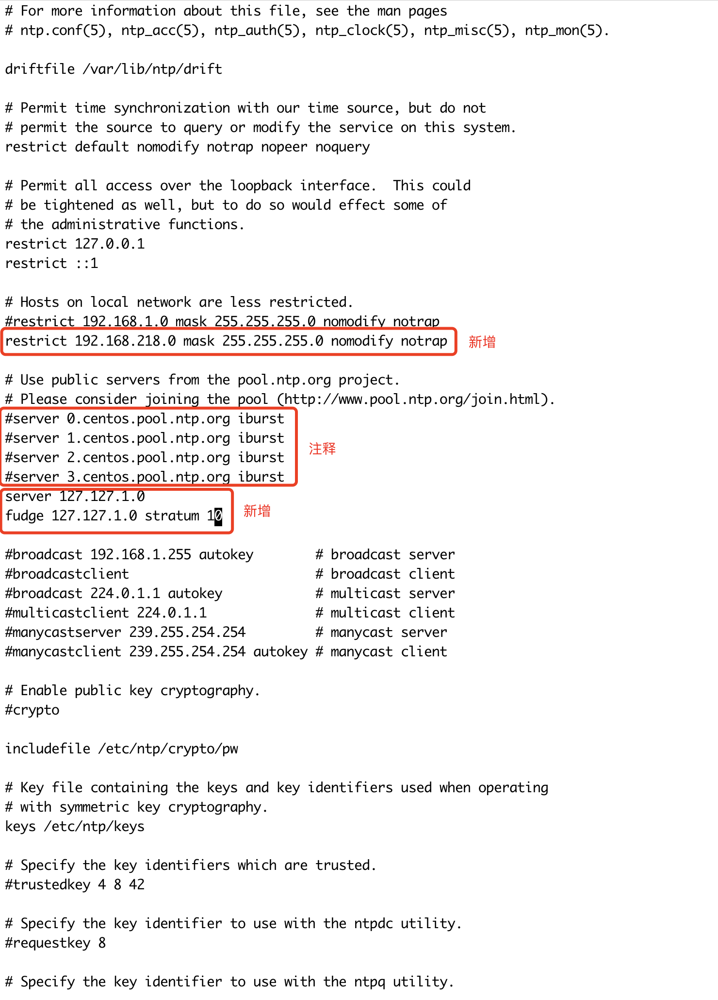
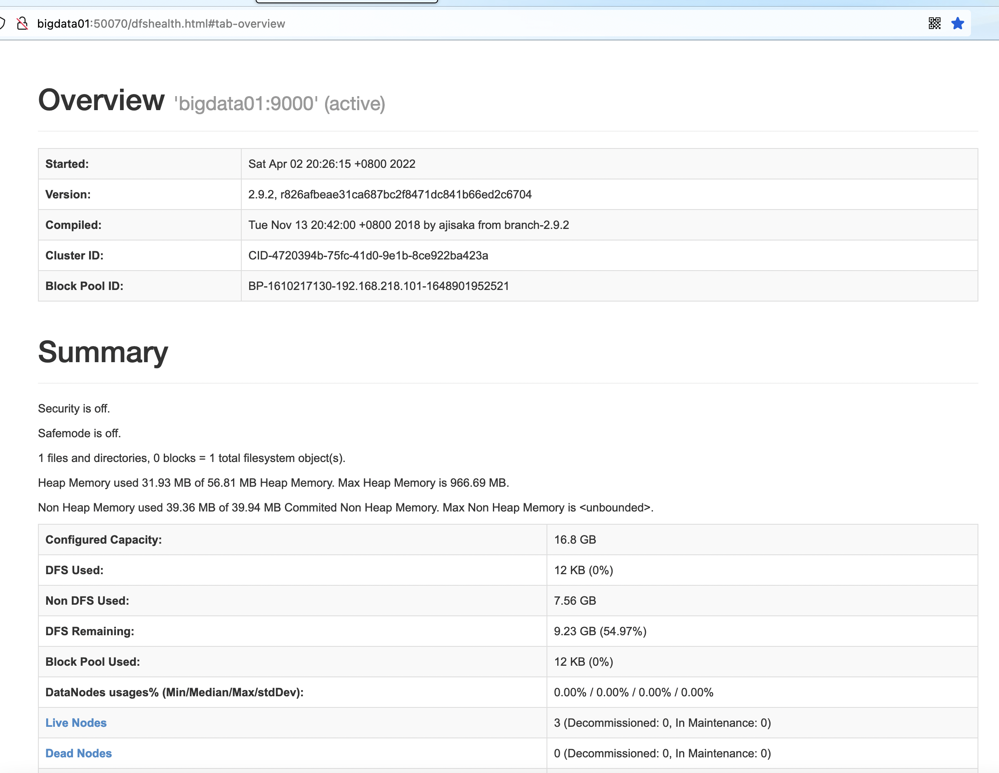
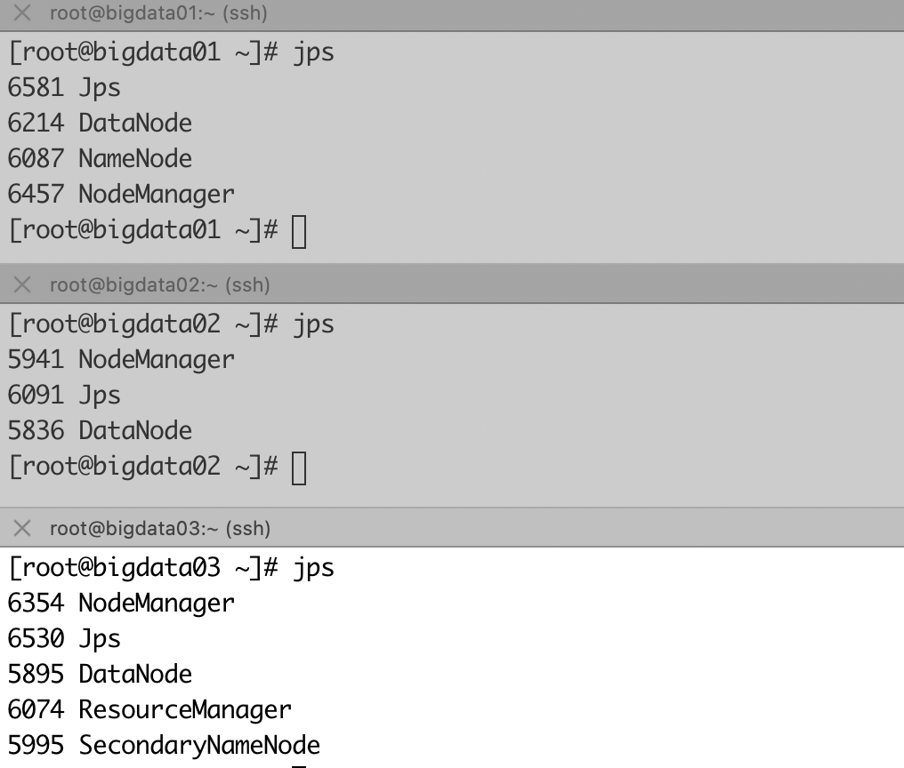

# Hadoop 分布式系统基础架构

## Apache Hadoop2完全分布式集群

### 虚拟机配置

#### 虚拟机环境

1. 主机：MacBook Pro，芯片：Apple M1 Max

2. 虚拟机：vmware fusion；

   3台centos7节点（静态ip、关闭防火墙、修改主机名、配置免密登陆、集群时间同步）

3. hadoop版本：2.9.2，JDK版本：1.8

#### 第1节 ip和hostname配置

1. ip配置

   ```
   #查看ip地址
   [root@192 ~]# ip addr
   #编辑配置文件
   [root@192 ~]# vi /etc/sysconfig/network-scripts/ifcfg-ens160
   TYPE=Ethernet
   PROXY_METHOD=none
   BROWSER_ONLY=no
   BOOTPROTO=static
   DEFROUTE=yes
   IPV4_FAILURE_FATAL=no
   IPV6INIT=yes
   IPV6_AUTOCONF=yes
   IPV6_DEFROUTE=yes
   IPV6_FAILURE_FATAL=no
   NAME=ens160
   DEVICE=ens160
   ONBOOT=yes
   IPADDR=192.168.218.101
   NETMASK=255.255.255.0
   GATEWAY=192.168.218.2
   DNS1=192.168.218.2
   
   #配置保存后，重启网络服务
   [root@192 ~]# service network restart
   
   #测试
   [root@192 ~]# ping www.baidu.com
   ```

2. hostname配置

   ```
   [root@192 ~]# vi /etc/hostname
   bigdata01
   ```

   配置完成后重启生效

3. 主机bigdata02、bigdata03主机的ip和hostname配置参照bigdata01

   | ip地址          | 主机名    |
   | --------------- | --------- |
   | 192.168.218.102 | bigdata02 |
   | 192.168.218.103 | bigdata03 |

4. 配置host映射（3台）

   ```
   #在文件/etc/hosts末尾追加配置
   192.168.218.101 bigdata01
   192.168.218.102 bigdata02
   192.168.218.103 bigdata03
   ```


#### 第2节 防火墙配置（3台）

1. 停用防火墙

   ```shell
   #查看防火墙状态
   systemctl status firewalld.service
   #停用
   systemctl stop firewalld.service
   ```

2. 配置开机自动关闭防火墙

   ```shell
    systemctl disable firewalld.service
   ```

#### 第3节 三台机器相互免密登陆

1. 三台机器生成密钥

   ```shell
   ssh-keygen -t rsa -P ""
   ```

2. mac

   ```shell
   scp ~/.ssh/id_rsa.pub root@bigdata01:/root/.ssh/id_rsa_mac.pub
   ```

3. bigdata02

   ```shell
   scp ~/.ssh/id_rsa.pub root@bigdata01:/root/.ssh/id_rsa_02.pub
   ```

4. bigdata03

   ```shell
   scp ~/.ssh/id_rsa.pub root@bigdata01:/root/.ssh/id_rsa_03.pub
   ```

5. bigdata01

   ```shell
   cd ~/.ssh/
   cat id_rsa.pub >> authorized_keys
   cat id_rsa_02.pub >> authorized_keys
   cat id_rsa_03.pub >> authorized_keys
   cat id_rsa_mac.pub >> authorized_keys
   scp authorized_keys root@bigdata02:/root/.ssh
   scp authorized_keys root@bigdata03:/root/.ssh
   ```

6. 测试

   ```shell
   #在三台机器上分别执行
   ssh bigdata01
   ssh bigdata02
   ssh bigdata03
   ```

#### 第4节 三台机器时间同步

**确保能连接外网, 时间同步的方式**：在集群中找一台机器（bigdata01）作为时间服务器，集群中其它机器与这台机器定时的同步时间，例如每隔5分钟同步一次时间。

1. 时间服务器配置（必须root用户）

   三台机器安装ntpd服务

   ```shell
   yum install -y ntp
   ```

   确保bigdata01 ntpd服务开启，bigdata02、bigdata03 ntpd服务开机关闭。

   **开启服务**

   ```
   #开启服务
   [root@bigdata01 ~]# systemctl start ntpd.service
   #查看状态
   [root@bigdata01 ~]# systemctl status ntpd
   #设置开机启动
   [root@bigdata01 ~]# systemctl enable ntpd.service
   ```

   **关闭服务**

   ```
   #开启服务
   systemctl stop ntpd.service
   #设置开机启动
   systemctl disable ntpd.service
   ```

2. 在bigdata01编辑/etc/ntp.conf

   ```
   restrict 192.168.218.0 mask 255.255.255.0 nomodify notrap
   #server 0.centos.pool.ntp.org iburst
   #server 1.centos.pool.ntp.org iburst
   #server 2.centos.pool.ntp.org iburst
   #server 3.centos.pool.ntp.org iburst
   server 127.127.1.0
   fudge 127.127.1.0 stratum 10
   ```

   

   配置`/etc/sysconfig/ntpd`，保证BOIS与系统时间同步

   ```
   #在文件末尾追加配置
   SYNC_HWLOCK=yes
   ```

   最后重新启动ntpd服务

3. 在bigdata02、bigdata03配置crontab任务（必须root用户）

   ```
   #编辑crontab任务
   crontab -e
   ```

   配置内容

   ```
   5 * * * * ntpdate 192.168.218.101
   ```

4. 测试

   ```
   #在bigdata02或bigdata03上任意修改时间
   date -s "2021-01-01 12:12:12"
   #5分钟后查看
   date
   ```

#### 第5节 bigdata01机器安装jdk

1. 查看自带的openjdk

   ```shell
   #查看自带软件包
   rpm -qa | grep java
   #卸载软件包
   rpm -e --nodeps 软件包
   ```

2. 创建安装目录

   ```shell
   #安装路径
   mkdir -p /opt/servers
   #软件压缩包存放路径
   mkdir /opt/software
   ```

3. 上传jdk到/opt/lagou/software路径并解压

   ```shell
   cd /opt/software/
   tar -zxvf jdk-8u311-linux-aarch64.tar.gz -C /opt/servers/
   cd /opt/servers/
   mv jdk1.8.0_311/ jdk1.8
   ```

4. 配置环境变量，在`/etc/profile`文件末尾追加以下配置

   ```shell
   export JAVA_HOME=/opt/servers/jdk1.8
   export PATH=.:$PATH:$JAVA_HOME/bin
   ```

   使环境变量生效`source /etc/profile`


### Hadoop集群环境搭建

#### 集群规划

| 框架 | bigdata01          | bigdata02   | bigdata03                    |
| ---- | ------------------ | ----------- | ---------------------------- |
| HDFS | NameNode、DataNode | DataNode    | SecondaryNameNode、DataNode  |
| Yarn | NodeManager        | NodeManager | NodeManager、ResourceManager |

#### 第1节 bigdata01机器上安装hadoop

1. 解压

   ```shell
   cd /opt/software/
   tar -zxvf hadoop-2.9.2.tar.gz -C ../servers/
   ```

2. 配置环境变量，在`/etc/profile`文件末尾追加配置

   ```shell
   export HADOOP_HOME=/opt/servers/hadoop-2.9.2
   export PATH=.:$PATH:$JAVA_HOME/bin:$HADOOP_HOME/bin:$HADOOP_HOME/sbin
   ```

   是环境变量生效`source /etc/profile`

3. 验证

   ```
   [root@bigdata01 hadoop-2.9.2]# java -version
   java version "1.8.0_311"
   ......
   [root@bigdata01 hadoop-2.9.2]# hadoop version
   Hadoop 2.9.2
   ......
   ```


#### 第2节 hadoop目录简介


#### 第3节 集群配置

hadoop集群配置=HDFS集群配置 + MapReduce集群配置 + Yarn集群配置 

##### HDFS集群配置

进入配置目录`cd $HADOOP_HOME/etc/hadoop`

1. hadoop-env.sh，将JDK路径明确配置给HDFS

   ```shell
   export JAVA_HOME=/opt/servers/jdk1.8
   ```

2. core-site.xml，指定NameNode节点以及数据存储目录

   ```xml
   <configuration>
     <!-- 指定HDFS中NameNode的地址 -->
     <property>
       <name>fs.defaultFS</name>
       <value>hdfs://bigdata01:9000</value>
     </property>
     <!-- 指定Hadoop运行时产生文件的存储目录 -->
     <property>
       <name>hadoop.tmp.dir</name>
       <value>/opt/servers/hadoop-2.9.2/data/tmp</value>
     </property>
   </configuration>
   ```

3. hdfs-site.xml，指定SecondaryNameNode节点

   ```xml
   <configuration>
     <!-- 指定Hadoop辅助名称节点主机配置 --> 
     <property>
       <name>dfs.namenode.secondary.http-address</name>
       <value>bigdata03:50090</value>
     </property>
     <!--副本数量 -->
     <property>
       <name>dfs.replication</name>
       <value>3</value>
     </property>
   </configuration>
   ```

4. slaves，指定DataNode从节点(每个节点配置信息占一行) 

   ```
   bigdata01
   bigdata02
   bigdata03
   ```

##### MapReduce集群配置

1. mapred-env.sh，将JDK路径明确配置给MapReduce

   ```shell
   export JAVA_HOME=/opt/servers/jdk1.8
   ```

2. mapred-site.xml，指定MapReduce计算框架运行Yarn资源调度框架

   ```shell
   mv mapred-site.xml.template mapred-site.xml
   ```

   ```xml
   <configuration>
     <!-- 指定MR运行在Yarn上 -->
     <property>
       <name>mapreduce.framework.name</name>
       <value>yarn</value>
     </property>
   </configuration>
   ```

##### Yarn集群配置

1. yarn-env.sh，将JDK路径明确配置给Yarn

   ```shell
   export JAVA_HOME=/opt/servers/jdk1.8
   ```

2. yarn-site.xml，指定ResourceManager老大节点所在计算机节点

   ```xml
   <configuration>
     <!-- 指定YARN的ResourceManager的地址 -->
     <property>
       <name>yarn.resourcemanager.hostname</name>
       <value>bigdata03</value>
     </property>
     <!-- Reducer获取数据的方式 -->
     <property>
       <name>yarn.nodemanager.aux-services</name>
       <value>mapreduce_shuffle</value>
     </property>
   </configuration>
   ```

3. 指定NodeManager节点（slaves文件配置已配置完成) 

> **注意：**hadoop安装目录所属用户和所属用户组信息，默认是501 dialout，而我们操作Hadoop集群的用户使用的是虚拟机的root用户， 所以为了避免出现信息混乱，修改Hadoop安装目录所属用户和用户组！！！
>
> `chown -R root:root /opt/servers/hadoop-2.9.2`

#### 第4节 脚本分发配置

`rsync` 远程同步工具 

rsync主要用于备份和镜像。具有速度快、避免复制相同内容和支持符号链接的优点。

rsync和scp区别：用rsync做文件的复制要比scp的速度快，rsync只对**差异文件做更新**。scp是把所有文件都复制过去。 

| 参数 | 说明         |
| ---- | ------------ |
| -r   | 递归         |
| -v   | 显示复制过程 |
| -l   | 拷贝符号连接 |

**期望脚本**：脚本+要同步的文件名称 

1. 三台机器安装rsync

   ```shell
   yum install -y rsync
   ```

2. 脚本实现

   ```shell
   cd /usr/local/bin/
   touch rsync-script
   chmod +x rsync-script
   ```

   编辑脚本

   ```shell
   #!/bin/bash
   
   #1 获取输入参数个数，如果个数为0，直接退出
   paramnum=$#
   echo $paramnum
   if [ $paramnum -eq 0 ]
   then
   echo no params
   exit
   fi
   
   #2 根据传入参数获取文件名称
   p1=$1
   fname=`basename $p1`
   echo $fname
   
   #3 获取输入参数的绝对路径
   pdir=`cd -P $(dirname $p1); pwd`
   echo pdir=$pdir
   
   #4 获取用户名称
   user=`whoami`
   
   #5 循环执行rsync
   for((host=1; host<4; host++))
   do
   echo ****** bigdata0$host ******
   hostname=bigdata0$host
   rsync -rvl $pdir/$fname $user@$hostname:$pdir
   done
   ```

   分发jdk目录，hadoop目录和/etc/profile

   ```shell
   cd /opt/servers/
   rsync-script jdk1.8
   rsync-script hadoop-2.9.2/
   rsync-script /etc/profile
   ```

   在bigdata02、bigdata03机器上执行`source /etc/profile`使环境变量生效

#### 第5节 集群启动

> **注意：如果集群是第一次启动，需要在Namenode所在节点格式化NameNode，非第一次不用执行格式化Namenode操作！！！**

   ```shell
hadoop namenode -format
   ```


##### bigdata01上启动HDFS

```
[root@linux121 ~]# start-dfs.sh
```

[查看HDFS界面 -bigdata01:50070 ](http://bigdata01:50070)



##### bigdata03上启动YARN

```shell
start-yarn.sh
```

> **注意：NameNode和ResourceManger不是在同一台机器，不能在NameNode上启动 YARN，应该在ResouceManager所在的机器上启动YARN。**



#### 第6节 集群测试

1. 从linux本地文件系统上传、下载文件

   ```
   [root@linux121 ~]# hdfs dfs -mkdir -p /test/input
   [root@bigdata01 ~]# cd ~
   [root@linux121 ~]# vi test.txt
   hello world
   
   #上传linux文件到hdfs目录/test/input目录下
   [root@bigdata01 ~]# hdfs dfs -put ~/test.txt /test/input
   #从hdfs下载文件到linux本地
   
   [root@bigdata01 ~]# hdfs dfs -get /test/input/test.txt
   get: `test.txt': File exists
   #从hdfs下载文件到linux本地，命名为test.txt.bak
   [root@linux121 ~]# hdfs dfs -get /test/input/test.txt test.txt.bak
   ```

2. mapreduce wordcount分布式计算案例

   ```
   #在HDFS文件系统根目录下面创建一个wcinput文件夹
   [root@linux121 ~]# hdfs dfs -mkdir /wcinp
   
   #在linux /root/目录下创建一个wc.txt文件
   [root@bigdata01 ~]# vi wc.txt
   hadoop mapreduce yarn
   hdfs hadoop mapreduce
   mapreduce yarn hive
   hbase spark redis
   kafka
   
   #上传wc.txt到HDFS目录/wcinput下
   [root@bigdata01 ~]# hdfs dfs -put ./wc.txt /wcinput
   
   #进入Hadoop mapreduce示例jar包目录
   [root@bigdata01 ~]# cd $HADOOP_HOME/share/hadoop/mapreduce
   #执行mapreduce程序
   [root@bigdata01 mapreduce]# hadoop jar hadoop-mapreduce-examples-2.9.2.jar wordcount /wcinput /wcoutput
   ```

   查看结果

   ```
   [root@bigdata01 ~]# hdfs dfs -cat /wcoutput/part-r-00000
   hadoop	2
   hbase	1
   hdfs	1
   hive	1
   kafka	1
   mapreduce	3
   redis	1
   spark	1
   yarn	2
   ```

#### 第7节 配置历史服务器

在Yarn中运行的任务产生的日志数据不能查看，为了查看程序的历史运行情况，需要配置一下历史日志服务器。

1. 配置mapred-site.xml，在文件中增加以下配置

   ```xml
     <property>
       <name>mapreduce.jobhistory.address</name>
       <value>bigdata01:10020</value>
     </property>
     <!-- 历史服务器web端地址 -->
     <property>
       <name>mapreduce.jobhistory.webapp.address</name>
       <value>bigdata01:19888</value>
     </property>
   ```

2. 分发mapred-site.xml到其它节点

   ```
   [root@bigdata01 hadoop]# rsync-script mapred-site.xml
   ```

3. 在bigdata01上启动历史服务器

   ```
   [root@bigdata01 hadoop]# mr-jobhistory-daemon.sh start historyserver
   ```

   查看是否有JobHistoryServer进程

   ```
   [root@bigdata01 hadoop]# jps
   6005 DataNode
   6566 JobHistoryServer
   6633 Jps
   6238 NodeManager
   5871 NameNode
   ```

4. web查看jobhistory（http://bigdata01:19888/jobhistory）

#### 第8节 配置日志的聚集

日志聚集：应用( Job)运行完成以后，将应用运行日志信息从各个task汇总上传到HDFS系统上。 日志聚集功能好处：可以方便的查看到程序运行详情，方便开发调试。 

> **注意：开启日志聚集功能，需要重新启动NodeManager、ResourceManager和HistoryManager。** 

1. 配置yarn-site.xml

   ```xml
     <!-- 日志聚集功能使能 -->
     <property>
       <name>yarn.log-aggregation-enable</name>
       <value>true</value>
     </property>
     <!-- 日志保留时间设置7天 -->
     <property>
       <name>yarn.log-aggregation.retain-seconds</name>
       <value>604800</value>
     </property>
     <property>
       <name>yarn.log.server.url</name>
       <value>http://bigdata01:19888/jobhistory/logs</value>
     </property>
   ```

2. 分发yarn-site.xml到集群其它节点

   ```
   [root@bigdata01 hadoop]# rsync-script yarn-site.xml
   ```

3. 关闭yarn服务和historyManager

   ```
   #bigdata03上
   [root@bigdata03 ~]# stop-yarn.sh
   #bigdata01上
   [root@bigdata01 hadoop]# mr-jobhistory-daemon.sh stop historyserver
   ```

4. 开启yarn服务和historyManager 

   ```
   #bigdata03上
   [root@bigdata03 ~]# start-yarn.sh
   #bigdata01上
   [root@bigdata01 hadoop]# mr-jobhistory-daemon.sh start historyserver
   ```

5. 删除HDFS上已经存在的输出文件，并执行wordcount程序

   ```
   [root@bigdata01 ~]# hdfs dfs -rm -R /wcoutput
   [root@bigdata01 ~]# cd $HADOOP_HOME/share/hadoop/mapreduce
   [root@bigdata01 mapreduce]# hadoop jar hadoop-mapreduce-examples-2.9.2.jar wordcount /wcinput /wcoutput
   ```

6. 查看日志 http://bigdata01:19888/jobhistory，最后如下图

   

   

   

   全部日志

   

## iTerm2

### step1 macOS上配置

1. 安装brew

   ```
   suker@sukerdembp ~ % /bin/bash -c "$(curl -fsSL https://cdn.jsdelivr.net/gh/ineo6/homebrew-install/install.sh)"
   ```

2. 使用brew安装lrzsz

   ```
   suker@sukerdembp ~ % brew install lrzsz
   ```

3. 下载[iterm2-send-zmodem和iterm2-recv-zmodem](https://github.com/aikuyun/iterm2-zmodem)，把文件移动到/usr/local/bin/

4. 添加可执行权限

   ```
   suker@sukerdembp ~ % chmod +x /usr/local/bin/iterm2-*
   ```

5. 设置iterm触发器

   选择菜单iTerm2->Preferences...->Profiles

   选择test中的Advanced -> Triggers -> edit, 分别添加send和recv规则

   - send配置

     ```
     Regular Expression: \*\*B0100
     Action: Run Silent Coprocess...
     Parameters: /usr/local/bin/iterm2-send-zmodem.sh
     Instant: ✔︎
     ```

   - recv配置

     ```
     Regular Expression: \*\*B00000000000000
     Action: Run Silent Coprocess...
     Parameters: /usr/local/bin/iterm2-recv-zmodem.sh
     Instant: ✔︎
     ```

###  step2 centos主机test配置

1. 安装rz、sz命令

   ```
   [root@test ~]# yum install lrzsz   
   ```

2. 测试`rz`,`sz`命令

   ```
   #上传命令
   [root@test ~]# rz -y
   #待弹出文件选择框后选择文件
   
   #下载if-cfg-ens33文件命令
   [root@test ~]# sz ifcfg-ens33
   ```

   

# 