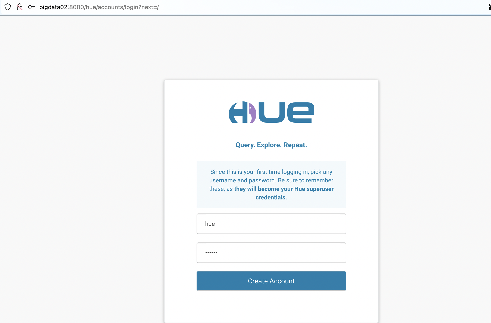

# Hue安装部署

## 第1节 Hue概述

Hue(Hadoop User Experience)是一个开源的 Apache Hadoop UI 系统，最早是由Cloudera Desktop演化而来，由 Cloudera贡献给开源社区，它是基于Python Web框架Django实现的。通过使用Hue可以在浏览器端的Web控制台上与 Hadoop集群进行交互来分析处理数据，例如操作HDFS上的数据，运行MapReduce Job等。

Hue所支持的功能特性如下

- 默认基于轻量级sqlite数据库管理会话数据，用户认证和授权，可以自定义为 MySQL、Postgresql，以及Oracle

- 基于文件浏览器(File Browser)访问HDFS
- 基于Hive编辑器来开发和运行Hive查询
- 支持基于Solr进行搜索的应用，并提供可视化的数据视图，以及仪表板 (Dashboard)
- 支持基于Impala的应用进行交互式查询
- 支持Spark编辑器和仪表板(Dashboard)
- 支持Pig编辑器，并能够提交脚本任务
- 支持Oozie编辑器，可以通过仪表板提交和监控Workflow、Coordinator和 Bundle
- 支持HBase浏览器，能够可视化数据、查询数据、修改HBase表
- 支持Metastore浏览器，可以访问Hive的元数据，以及HCatalog
- 支持Job浏览器，能够访问MapReduce Job(MR1/MR2-YARN)
- 支持Job设计器，能够创建MapReduce/Streaming/Java Job
- 支持Sqoop 2编辑器和仪表板(Dashboard)
- 支持ZooKeeper浏览器和编辑器
- 支持MySql、PostGresql、Sqlite和Oracle数据库查询编辑器

Hue是一个友好的界面集成框架，可以集成我们各种学习过的以及将要学习的框架，一个界面就可以做到查看以及执行所有的框架。


类似的产品还有Apache Zeppelin


## 第2节 Hue安装编译

Hue官方网站 https://gethue.com/

HUE官方用户手册 https://docs.gethue.com/

官方安装文档 https://docs.gethue.com/administrator/installation/install/

HUE下载地址 https://docs.gethue.com/releases/

Hue的安装并不是那么简单，官方并没有编译好的软件包，需要从github上下载源码、安装依赖、编译安装。以下详细讲解Hue下载、编译、安装的操作过程。

安装Hue的节点上最好没有安装过MySQL，否则可能有版本冲突，这里选择将Hue安装在bigdata02上。

> 1、下载软件包、上传、解压(hue-release-4.3.0.zip、apache-maven-3.6.3- bin.tar.gz)
>
> 2、安装依赖包
>
> 3、安装maven
>
> 4、hue编译
>
> 5、修改hadoop配置
>
> 6、修改hue配置
>
> 7、启动hue服务

1. 下载软件包

   hue-release-4.3.0.zip；上传至服务器/opt/software，并解压缩

2. 安装依赖

   ```shell
   # 需要python支持（Python2.7+/Python3.5+）
   python --version
   
   export PYTHON_VER=python3.8
   
   # 在CentOS系统中安装编译Hue需要的依赖库
   sudo yum install ant asciidoc cyrus-sasl-devel cyrus-sasl-gssapi cyrus-sasl-plain gcc gcc-c++ krb5-devel libffi-devel libxml2-devel libxslt-devel make mysql mysql-devel openldap-devel python-devel sqlite-devel gmp-devel
   
   yum install -y libtidy
   yum install -y openssl-devel
   yum install -y rsync
   ```

   备注

   以上依赖仅适用CentOS/RHEL 7.X，其他情况请参考https://docs.gethue.com/administrator/installation/dependencies/

   安装Hue的节点上最好没有安装过MySQL，否则可能有版本冲突安装过程中需要联网，网络不好会有各种奇怪的问题

3. 安装maven

   编译Hue还需要Maven环境，因此在编译前需要安装Maven。

   下载 apache-maven-3.6.3-bin.tar.gz，上传虚拟机解压缩

   ```
   tar -zxvf /opt/software/apache-maven-3.6.3-bin.tar.gz -C /opt/servers/
   ```

   添加环境变量`/etc/profile`

   ```
   export MAVEN_HOME=/opt/servers/apache-maven-3.6.3
   export PATH=$PATH:$MAVEN_HOME/bin
   ```

   测试

   ```
   mvn --version
   ```

4. 编译

   首先安装pip，只针对python2

   ```shell
   yum remove python-pip
   wget https://bootstrap.pypa.io/pip/2.7/get-pip.py
   python get-pip.py
   ```

   然后进入软件目录解压，编译

   ```
   yum install unzip
   #解压
   cd /opt/software/
   unzip hue-release-4.3.0.zip
   #进入hue源码目录，进行编译。使用PREFIX指定安装Hue的路径
   cd ./hue-release-4.3.0
   PREFIX=/opt/servers make install
   
   # 如果想把HUE从移动到另外一个地方，由于HUE使用了Python包的一些绝对路径,移动之后则必须执行以下命令:
   # 这里不要执行
   rm app.reg
   rm -r build
   make apps
   ```

   备注: 编译持续的时间比较长，还会从网上下载jar；需要联网

5. 修改hadoop配置文件

   在hdfs-site.xml中增加配置

   ```xml
   <configuration>
     <!-- HiveServer2 连不上10000;启用 webhdfs 服务 -->
     <property>
       <name>dfs.webhdfs.enabled</name>
       <value>true</value>
     </property>
     <property>
       <name>dfs.permissions.enabled</name>
       <value>false</value>
     </property>
   </configuration>
   ```

   在core-site.xml中增加配置

   ```xml
     <property>
       <name>hadoop.proxyuser.hue.hosts</name>
       <value>*</value>
     </property>
     <property>
       <name>hadoop.proxyuser.hue.groups</name>
       <value>*</value>
     </property>
     <property>
       <name>hadoop.proxyuser.hdfs.hosts</name>
       <value>*</value>
     </property>
     <property>
       <name>hadoop.proxyuser.hdfs.groups</name>
       <value>*</value>
     </property>
   ```

   增加httpfs-site.xml文件，加入配置

   ```xml
   <configuration>
     <!-- HUE -->
     <property>
       <name>httpfs.proxyuser.hue.hosts</name>
       <value>*</value>
     </property>
     <property>
       <name>httpfs.proxyuser.hue.groups</name>
       <value>*</value>
     </property>
   </configuration>
   ```

   **备注：修改完HDFS相关配置后，需要把配置scp给集群中每台机器，重启hdfs服务。**

6. Hue配置

   ```
   # 进入配置目录
   cd /opt/servers/hue/desktop/conf/
   
   # 复制一份HUE的配置文件，并修改复制的配置文件
   cp pseudo-distributed.ini.tmpl pseudo-distributed.ini
   vi pseudo-distributed.ini
   ```

   修改配置

   ```
   # [desktop]
   	http_host=bigdata02
   	http_port=8000
   	is_hue_4=true
   	time_zone=Asia/Shanghai
   	dev=true
   	server_user=hue
   	server_group=hue
   	default_user=hue
   # 211行左右。禁用solr，规避报错
   	app_blacklist=search
   # [[database]]。Hue默认使用SQLite数据库记录相关元数据，替换为mysql
   	engine=mysql
   	host=bigdata03
   	port=3306
   	user=hive
   	password=123456
   	name=hue
   
   # 1003行左右，Hadoop配置文件的路径
   	hadoop_conf_dir=/opt/servers/hadoop-2.9.2/etc/hadoop
   ```

   在mysql中创建数据库

   ```
   [root@bigdata03 ~]# mysql -u hive -p123456
   mysql> create database hue;
   ```

   初始化数据

   ```
   cd /opt/servers/hue/
   build/env/bin/hue syncdb
   build/env/bin/hue migrate
   ```

   错误：

   ```
   django.db.utils.OperationalError: (2059, "Authentication plugin 'caching_sha2_password' cannot be loaded: /usr/lib64/mysql/plugin/caching_sha2_password.so: cannot open shared object file: No such file or directory")
   ```

   目前最新的mysql8.0数据库对用户密码的加密方式为caching_sha2_password, django暂时还不支持这种加密方式。所以只需将加密方式改为老版的即可。

   ```
   mysql> set global validate_password.policy=0;
   mysql> set global validate_password.length=1;
   mysql> alter user 'hive'@'%' identified with mysql_native_password by "123456";
   mysql> flush privileges;
   ```

7. 启动Hue服务

   ```
   # 增加 hue 用户和用户组
   groupadd hue
   useradd -g hue hue
   # 在hue安装路径下执行
   build/env/bin/supervisor
   ```

   在浏览器中输入：**bigdata02:8000**，可以看见以下画面，说明安装成功。

   第一次访问的时候，需要设置超级管理员用户和密码。记住它(hue/123456)

   


# Hue整合Hadoop、Hive

配置文件`/opt/servers/hue/desktop/conf/pseudo-distributed.ini`

1. 集成HDFS、Yarn

   ```
   # 211 行。 没有安装 Solr，禁用，否则一直报错
   	app_blacklist=search
   	
   # [hadoop] -- [[hdfs_clusters]] -- [[[default]]]
   # 注意端口号。下面语句只要一个
   	# fs_defaultfs=hdfs://localhost:8020
   	fs_defaultfs=hdfs://bigdata01:9000
   	webhdfs_url=http://bigdata01:50070/webhdfs/v1
   # 211 行
   	hadoop_conf_dir=/opt/lagou/servers/hadoop-2.9.2/etc/hadoop
   	
   # [hadoop] -- [[yarn_clusters]] -- [[[default]]]
   	resourcemanager_host=bigdata03
   	resourcemanager_port=8032
   	submit_to=True
   	resourcemanager_api_url=http://bigdata03:8088
   	proxy_api_url=http://bigdata03:8088
   	history_server_api_url=http://bigdata03:19888
   ```

2. 集成Hive

   在bigdata03上需要启动Hiveserver2服务

   ```
   [beeswax]
     hive_server_host=bigdata03
     hive_server_port=10000
     hive_conf_dir=/opt/servers/hive-2.3.7/conf
   ```

3. 集成MySQL

   ```
   # [librdbms] -- [[databases]] -- [[[mysql]]];1639行
   # 注意:1639行原文: ##[[mysql]] => [[mysql]];两个##要去掉!
       [[[mysql]]]
         nice_name="My SQL DB"
         name=hue
         engine=mysql
         host=bigdata03
         port=3306
         user=hive
         password=123456
   ```

   > name是database名称
